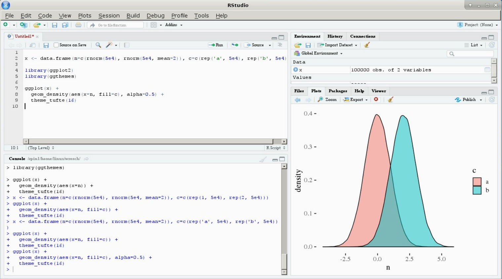

```{r setup, include=FALSE}
knitr::opts_chunk$set(echo = TRUE, message=FALSE, warning=FALSE , error=TRUE)
```

# Workflow: RStudio e Scripts. 

## O que é o R?

R é uma linguagem de programação de código aberto, versátil, útil tanto para estatística quanto para ciência de dados. É Inspirada na linguagem de programação S. Essas são algumas das principais vantagens do R:

* Software de código aberto.
* Superior (se não apenas comparável) às alternativas comerciais. Em janeiro de 2019, R ocupava o 12º lugar no índice TIOBE, que mede a popularidade das linguagens de programação. É amplamente utilizado na academia e na indústria, especialmente no círculo de cientistas de dados.
* Disponível em todas as plataformas (Unix, Windows, Linux).
* Como resultado de ser uma linguagem de dados aberta, se você fizer sua análise em R, qualquer pessoa poderá replicá-la facilmente.
* Funciona não apenas para análise estatística, mas também **programação de uso geral**.
* É **linguagem de objetos** (= R possui objetos) e **funcional** (= Você pode escrever funções).
* Grande e crescente comunidade de usuários.

## Rstudio

O RStudio é a principal interface gráfica do usuário (GUI) e o ambiente de desenvolvimento integrado (IDE) que facilita o uso do R.

## Como escrever códigos em R?

A maior parte dos usuários iniciantes em R costuma digitar seus códigos diretamente na linha de comando. **Esta é uma péssimoa opção**. 

A melhor forma para trabalhar com R consiste em utilizar scripts. Estes scripts -- que não são nada mais do que um arquivo de texto -- permite a você contruir seu código de forma mais integrada, e com mais flexibilidade. 

Vamos revisar como funciona o R Studio, para entender melhor a utilização de scripts, e fluxos básicos de programação em R. 

## Navegando no R Studio. 




## Noções básicas.

Abra o RStudio! Em seguida, abra um novo script clicando em "Arquivo -> Novo arquivo -> Script R" ou pressionando `Ctrl + Shift + N` (PC) ou` command + shift + N` (Mac). Depois de abrir um novo script, você verá quatro "painéis".

### Painel superior esquerdo (entrada / script)

Neste painel, você escreve seu código. Digite `2 + 2` no seu script e execute uma linha de código pressionando` command + enter` (Mac) ou `Ctrl + enter` (PC). Ou clique no botão "Executar" na parte superior do script.

O nome do seu arquivo de script está na guia na parte superior da janela do script - o nome padrão é `Untitled1`. Certifique-se de salvar seu script clicando em "Arquivo -> Salvar" ou `command + s` (Mac) ou` Ctrl + s` (PC). Você também pode clicar no ícone de disquete para salvar.

### Painel inferior esquerdo (saída / console)

O resultado do código é exibido no `console 'no painel inferior esquerdo. Esse espaço também é bom para procurar e experimentar o código que você não deseja salvar em seu script.

### Painel superior direito (ambiente global)

Os dados são salvos na memória de R como **objetos**. Os objetos são simplesmente espaços reservados para um valor, expressão matemática, palavra, função ou conjunto de dados! A guia "Ambiente" global no painel superior direito exibe as variáveis que você atribuiu / salvou. 

### Painel inferior direito (arquivos, plotagens, pacotes e ajuda)

Aqui você encontra guias úteis para navegar no sistema de arquivos, exibir gráficos, instalar pacotes e visualizar páginas de ajuda. Pressione a tecla `control` e um número (1 a 9) no teclado para atalho entre esses painéis e guias.


# Como Interagir com R

Há duas formas para interagir com R via R Studio. 

- Via Console (Tela Inferior Esquerda).

- Via Script. (Tela Superior Esquerda)


## R via console.

No console, o prompt `>` indica que seu R está pronto para receber o comando. Copie e cole o código abaixo em seu Console e click Enter.

```{r}
2+2
```

Se o seu prompt estiver com  símbolo `+`, basta clicar no console e pressionar a tecla `esc` no teclado quantas vezes forem necessárias para retornar ao prompt. O R usa `+` quando o código é dividido em várias linhas e o prompt ainda espera mais código. 

Uma linha de código geralmente não termina até que R encontre um parâmetro ou pontuação de parada apropriado que conclua algum código, como parêntese fechado fechado `)`, colchete `]`, colchete `}` ou aspas `` `.

Por exemplo, copie e cole este código em seu console

```{r eval=FALSE}
incompleto <- "Eu sou um objeto incompleto
```

Você verá em seu R como este código está incompleto. Faltou você fechar as aspas. Por isto, o promt to R estava com o símbolo `+`, esperando você finalizar a linha de código.


## Abrindo um script

Você pode abrir um script novo clicando na aba `File` -> `New File` -> `R Script`.  O seu editor de script funciona basicamente como um documento de texto qualquer. Na verdade você pode escrever seu código em um editor de texto (notepad), e copiar e colar para seu console, ou linha de comando do seu computador. 

O RStudio integra este editor de script com outras ferramentas, **incluindo o console**. Por isto, o RStudio é considerado um ambiente de desenvolvimento integrado (IDE). Agora, abra um script, e copie e cole o código abaixo. Depois, rode usando `command + enter` (Mac) ou `Ctrl + enter` (PC). 

```{r}
2^2
2*2
2/2
```


Programadores em geral não utilizam diretamente o console, seja em R, Python, Java, ou qualquer outro. Utilizar um script traz inúmeros vantagens: mais flexibilidade ao código, permite escrever códigos mais longos e complexos, fazer comentários no seu código, explicar suas decisões e permitir que outros entendem melhor seus códigos, salvar seus códigos e compartilhá-lhos são apenas algumas das vantagens de usar um editor de script. 

### Quando deve criar um script?

Organizar seus códigos, pastas e fluxo de trabalho em R é fundamental. Na próxima semana, discutiremos este tópico em detalhes!

Porém, vamos a nossa regra para criação de script. Eu recomendo que você tenha um script para cada tarefa distinta executada em R. Por exemplo, eu sugiro que vocês tenham um script para cada uma de nossas aulas. 


### Commentários

Uma hashtag `#` diz ao R que você não deseja que essa linha ou bloco de código seja executado - isso é chamado de **comentando seu código**. Isso é útil para você fazer anotações e pode até adicionar hashtags após linhas de código executável, na mesma linha.

**Sempre anote seus códigos** Ajude você no futuro!

#  Pacotes em R. 

Um pacote em R é simplemente um conjunto de funções - e às vezes com dados - disponibilizados por outros usuários ou pela própria equipe de manutenção e criação do R. Estas funções em gerais são colocadas juntas em um pacote porque servem a um propósito específico, por exemplo,  um modelo estatístico novo, um conjunto de funções para visualização de dados ou um pacote com funções para acessar dados eleitorais. 

Instalar um pacote consiste, basicamente, em fazer download de uma pasta -- onde estão salvas um conjunto de funções -- para seu computador. Por isso, você instala o pacote somente uma vez. 

No entanto, cada vez que você abre seu R, você precisa lembrá-lo de que você possui determinados pacotes instalados, e, ao invés de baixar tudo outra vez, você pode somente ativá-los. Esta é a diferença entre `install.packages()` e `library()`


## Instalar Pacotes Via Cran.

O CRAN é o repositório oficial do R. Lá estão todos os pacotes que cumprem determinados requisitos da equipe do R, e, portanto, entram no repositório oficial.

```{r eval=FALSE}
install.packages("devtools", force=TRUE)
```


## Ativar um pacote. 

```{r eval=FALSE}
library(devtools)
```


## Instalar Pacotes Via Github. 

Nem todos os pacotes estão no CRAN. Há pacotes, e versões mais atualizadas de determinados pacotes, que estão disponíveis no Github -- um repositório de códigos para programadores. 

```{r eval=FALSE}
install_github("silvadenisson/electionsBR")
```


# Funções de Ajuda. 

Há duas formas principais de pedir ajuda em R. 

## Pedindo ajuda via R

Todas as funções e pacotes de R possuem uma documentação. Esta documentação explica como utilizar determinada função, quais seus argumentos, e provê exemplos de uso. Esta ajuda aparecerá em painel inferior direito. Você pede ajuda desta forma:


```{r}
# Ajuda específica.
?mean  # Help para a função mean.
help(mean)

# Ajuda mais geral: busca todas as ocorrências do nome da função. 
??mean

```

## Pedindo ajuda via Google.

Você  deve usar o Google e o StackOverflow para solucionar erros em seus códigos. Aqui estão algumas dicas sobre como pesquisar erros no Google:

- **Google**: nome do função/pacote + texto na mensagem de erro.

- Remova as informações específicas do usuário e dos dados primeiro!

- Veja se você consegue encontrar exemplos que produzem e não produzem o erro. Experimente o código de outras pessoas, mas 

- Tende entender a solução. Copiar e Colar não resolver seu problema. 

## A Regra dos 15 minutos

Retirado de  [Rochele Terman plsc-31101](https://plsc-31101.github.io/course/introduction.html).

```{r echo=FALSE, out.width = "50%"}
library(tweetrmd)
library(webshot)
tweetrmd::tweet_screenshot(tweet_url("math_rachel", "764931533383749632"))

```


# Objetos em R. 

Cada linguagem de programação possui regras próprias sobre como criar, acessar e guardar variáveis no seu ambiente de trabalho. 

Em R, variáveis, ou objetos, são criados atribuindo determinado **dado** a um determinado **nome**, e você pode acessá-los exatamente por nome atribuído. 

## Criando Objetos

Para criar um objeto usamos esta função de atribuição *(assignment operator)* `<-`. 

```{r}
# Variáveis Numéricas
x <- 5
y <- 7

# Variáveis de Texto.
nome <- "Tiago Ventura"


```

Acima, nós atribuímos os **valores** 5, 7, e "Tiago Ventura" aos objetos de **nome** x, y, e nome.  

Esta é a lógica: `object_name <- value`

É possível criar variáveis utilizando `=`. Porém, o uso deste operador não é recomendado, visto que `=` também possui diversas outras funcionalidade em R. Por exemplo:

```{r}
mean(x=c(5, 7))
```

### Pergunta: Qual o valor de x agora?

```{r eval=FALSE}
????
```

## Objetos no ambiente de trabalho? 

Todos os objetos de R estão salvos em nosso ambiente de trabalho e podemos acessá-los diretamente, usando o nome dos objetos.

```{r}
# Verificar ambiente de trabalho
ls()

# Acessando os objetos
x
y
x+y
```


## Removendo Objetos.

```{r}

# Para Remover
rm(x)

ls()

```

## Visualizando objetos.

```{r}
nome # ou 
print(nome)
```

## Modificando objetos.

```{r}
nome <- "Tiago Augusto Ventura"

```

## Regras para nomes dos objetos.

Nomes de objetos podem conter apenas letras, números, "_" e ".."

**Boas Práticas**: crie nomes de forma efetiva, que descrevem de forma acurada os objetos do seu ambiente de trabalho. 

Nosso objetivo enquanto acadêmicos é produzir ciência e pesquisa, e parte do processo de criar conhecimento consiste em compartilhar suas pesquisas, incluindo seus códigos. Portanto, crie nomes que qualquer outro acadêmico ao ler seu código entenderá a que este objeto se refere . 

`Alerta`: Nomes em R são sensitivos a capitalização. 

```{r}
r_intro_css <- 10
r_Intro_css
r_intro_css_
```


# Classes de Objetos

Cada objeto em R possui uma **Classe**. Em síntese, a classe descreve qual tipo de valores esse objeto está armazenando. De forma práticas, veremos objetos em R  nas seguintes classes:

- Character 

- Numeric

- Interger

- Logical


### Exemplos: 

```{r echo=FALSE}
library(kableExtra)
library(tidyverse)

tibble::tribble(~ Exemplo, ~ Tipo, 
                c("a", "swc"), "Character", 
                c(2, 3, 15), "Numeric", 
                c(1L, 2L), "Interger", 
                c(FALSE, TRUE), "Logical") %>%
  kbl() %>%
  kable_styling(bootstrap_options = c("striped", "hover", "condensed"))


```

Classas são importante porque o R está programado para lidar com estes tipos de variáveis. Em resumo, o R entende que determinado tipo de objeto é numérico, e portanto, este objetivo pode realizar determinadas funções. 


A função `class()` permite que você descubra a classe de um objeto. 

```{r}
class(3)

class(TRUE)

meu_numero_da_sorte= "13"

class(meu_numero_da_sorte)

class(meu_numero_da_sorte==13)

```


Um exemplo sobre como o R advinha as classes e usa-as para definir quais funções podem ser aplicadas a estes objetos:

```{r}
25 - "13"
```

Esta substituição retorna um erro porque o objeto "13" não é numérico, e operações matemáticas exigem objetos numéricos. 

## is.class?

É possível, por exemplo, checar diretamente se objetos são de determinada class. 

```{r}
is.numeric(2)
is.logical(TRUE)
is.character("2")
is.integer(1L)
```

# Coerção: Alterando Classes. 

Classes de objetos em R também podem ser alteradas usando as funções `as.class()`

```{r}
# Cria Objeto
num_1_5 <- c(1, 2, 3, 4, 5)

# Altera a classe
char_1_5 <- as.character(num_1_5)

# Checando
class(char_1_5)
class(num_1_5)

# Ou
as.numeric("25")

```

# Desafio 1. 

Vamos praticar um pouco o que aprendemos até aqui. O que os comandos abaixo retornarão? Qual o resultado e porquê?


#### Questão 1:


```{r eval=FALSE}
install.packages(tidyverse) # Este código irá funcionar?
```

#### Questão 2:

```{r eval=FALSE}
false <- "FALSE"
false <- as.logical(false)
class(false)
```


#### Questão 3
```{r eval=FALSE}
x=10
mean(x = sample(1:50, 5)) == mean(x) # TRUE ou FALSE

```

# Operadores Booleanos e Operadores Lógicos

Expressões booleanas são valores lógicos que retornam se determinada relação é verdadeira ou falsa.

Estão expressão booleanas são a base de diversas linguagens de programação, incluindo **R**. Usaremos expressões booleanas para filtrar vetores ou bancos de dados, escrever loops, funções, relações condicionais, ou simplesmente comparar dois números. 

Quando você digita uma expressão booleana em R, R produzirá TRUE se a expressão for verdadeira e FALSE se a expressão for falsa. Os operadores booleanos são:

```{r echo=FALSE}
tribble(~Operador, ~O_que_Faz, 
"<", 	"menor que", 
"<="	, "menor ou igual que ",
">"	, "maior que",
">="	, "maior ou igual que",
"=="	, "exatamente igual", 
"!="	, "diferente", 
"%in%", 	"é um objeto nesta lista") %>%
   kbl() %>%
  kable_styling(bootstrap_options = c("striped", "hover", "condensed"))

```

### Operadores Lógicos

Por outro lado, operadores lógicos servem para  combinar multiplas análises usando operadores booleanos. Operadores lógicos são:

```{r}
tribble(~Operador, ~O_que_Faz, 
" x & y ", 	" x E y", 
"x |  y "	, "x ou y",
"!x"	, "Oposto de x") %>%
   kbl() %>%
  kable_styling(bootstrap_options = c("striped", "hover", "condensed"))

```

Alguns exemplos:

```{r}
x <- 10

y <- 20

# Booleano Básico
x>y
x==y
x%in%y
x<y

# Operadores Lógicos

x>15 | y > 15

x >15 & y > 15

```

### Porquê isso importa?

Operadores Booleanos não são inicialmente intuitivos, e mais importante, é difícil de entender sua utilidade quando você inicia a programar. Porém, um bom entendimento de operadores booleanos e lógicos formam uma sólida base da sua capacidade de programçaõ em R. 

Uma das principais utilidades é usar operadores boleanos para filtrar variáveis. Esta lógica se aplica a estruturas de dados mais complexos, que veremos a seguir. 

```{r}
x <- sample(-50:50, 10)

# Quais números são positivos?
x>0

# Posso selecionar eles?
x[x>0]

```

# Estrutura de Dados. 

Um objeto pode ter diferente estruturas. Vamos vê-las rapidamente. 

- `vector`
- `matrix`
- `data.frame`
- `list`
- `array`

##  Vector

```{r}

# vetor de números
X <- c(1, 2.3, 4, 5, 6.78, 6:10)
X

# Class
class(X)

# Tamanho 
length(X)


```

## Matrix

Estrutura de Dados Retangular (Linhas x Colunas). Extremamente útil para operações matemáticas, rápida manipulação. 

**Principal característica:** comporta somente elementos numéricos

```{r}

# Coerce to a matrix
as.matrix(X)

# Cria uma Matrix do zero
matrix(1:10, nrow=5, ncol=2)

```

## List

A lista é extremamente útil para aplicações mais avançadas. Funciona como um repositório de vários objetos. É como uma grande gaveta onde você pode salvar sua bagunça. 

**Principal Característica**: Tudo cabe dentro de uma lista. Elementos podem ser de classes varidas. 

```{r}

# coerce to a list

as.list(X)

# or

lista_1 <- list(X, as.matrix(X), as.character(X))

# Visualize a lista.

str(list)

```

# Data Frame. 

Em português, banco de dados. É uma estrutura de dados retangular, porém, diferente da matrix, comporta colunas de classes diferentes. É como uma planilha de excel no seu ambiente R.

A existência de data frames como classes básicas do R é uma das característica que fizeram do R um software tão útil para ciência de dados, sobretudo, no que se refere a manipulação e limpeza de dados retangulares. O Python, por exemplo, não possui data frames em seus tipos de objetos básico. 

Vamos abaixo focar um pouco na manipulação de bancos de dados, dado que está é um conhecimento importante para nossas aplicações práticas. 

## Criando um banco de dados. 

```{r}

# Coercing
as.data.frame(X)

# Criando Manualmente

data <- data.frame(name=c("Tiago", "Tiago"), last_name=c("Ventura", "Ventura") , school=c("UMD", "FGV"), age=c(30,32))

```

Além disso, o R possui diversos bancos de dados pre-armazenados na sua memória, ou em pacotes disponíveis para download. Para começar, vamos instalar e fazer o download do banco de dados sobre o show do netflix *The Great British Bake Off*. Neste [link](https://github.com/apreshill/bakeoff), você pode ver mais informações do pacote

Este pacote possui um conjunto de bancos de dados. Para ativar o banco de dados do pacote, precisamos somente usar a função 
`data()`

```{r}
#devtools::install_github("apreshill/bakeoff")
library(bakeoff) # Chamando o pacote

# O que tenho no meu ambiente?
ls()

# ativa o banco de dados
data("bakers")
ls()

# Examine o objeto.
class(bakers)
str(bakers)
```

### Acessando dados em um Data Frame

**Pela Ordem da Coluna**

```{r}
bakers[,1] # primeira coluna
```

**Pela Nome da Coluna**

```{r}
bakers$age

# Ou

bakers[,"age"]

```

**Pela posição da linha**

```{r}
bakers[1:5, ]
```

**Por linha e coluna**

```{r}
bakers[1:5, "age"]
bakers[5:15, 3:5]
```

### Nota rápida sobre como acessar estruturas de dados. 

Há duas formas mais gerais de se acessar valores dentro de determinadas estruturas de dados (vetores, matrizes, listas...). É possível acessar via índices (indexes) e chaves (keys). 

Índices referem-se as posições de forma númerica. E as chaves são os textos, com nomes, de cada valor. Por exemplo, ao usarmos este commando `bakers[1,1]` acessamos a primeira linha e a primeira coluna. Por outro lado,  `bakers[1,"age"]` ou
`bakers$age`, acessamos usando a chave "age" que é o nome da coluna. 

Cada estrutura de dados possui formas específicas de acessar seus valores. Matrizes e Vetores permitem somente indexação númerica. Listas permitem índices e chaves. Vamos aprender mais sobre isso no decorrer do curso. 

### Funções úteis para data frames

A classe data.frame possuí algumas funções pré-construídas bastante úteis. Alguns exemplos:

```{r}
head(bakers) # Mostra primeiras cinco linhas

tail(bakers) # últimas cinco linhas

summary(bakers) # clase de cada coluna

dim(bakes) # dimensões de linha e coluna

glimpse(bakers) # outro modo de ver seus dados. 

```

### Operações Boolenas: back, back, back again. 

Podemos filtrar bancos de dados com base em operações boleanas.

```{r}
# Bakers com mais de 60 anos
bakers[bakers$age>60,]

#Bakers de Londers
bakers[bakers$hometown=="London",]

```

Meio confuso né? Sim. Concordo. Por isso, vamos usar um pacote chamado [dplyr](https://dplyr.tidyverse.org/) para manipulação de bancos de dados. Vamos chegar lá nas próximas aulas. 


## Exportando banco de dados.

Uma função importante do R consiste em exportar seus resultados, incluindo um novo banco de dados. Há diversas funções para fazer isso, a depender do formato do output que você deseja. Alguns exemplos:

- `write.table()` for txt
- `write.csv()` for csv
- `write.xlsx` for xlsx
- `save()` to export as a RData

E muitas outras!

Um exemplo com .csv

```{r}
# make a fake data set

dfake <- data.frame(normal=rnorm(100, 0, 1), 
                    uniform=runif(100, 0, 1), 
                    pois=rpois(100, 10))

# write.function(data, name_to_be_saved)
write.csv(dfake, "dfake.csv")
```


### Mas... Onde estão meus dados? E onde R está olhando?

Na próxima semana, vamos discutir como organizar seus dados em R e como ter um fluxo de trabalho organizado. No entanto,  vamos aprender primeiro o básico sobre diretórios de trabalho no R -- que eu não recomendo seja sua rotina -- porém que nos ajuda a entender como o R funciona. 

Definir seu diretório de trabalho é um passo que sempre causa muita dor de cabeça à iniciantes em R. É simples, porém, como somos treinados com o point-and-click do windows, no começo pode parecer difícil. 

O `R` não sabe intuitivamente onde estão seus dados. Se os dados estiverem em uma pasta especial chamada "pesquisa super secreta", temos que dizer ao `R` como chegar lá.

Podemos fazer isso de duas maneiras:

- 1. Aprenda onde seus arquivos estão. 
- 2. Defina seu **diretório de trabalho** para essa pasta;

Toda vez que o `R` é inicializado, ele olha para o mesmo lugar (chamado de _global path_), a menos que seja solicitado a ir para outro lugar.

```{r}
# Onde meu R está olhando?
getwd()
```

```{r eval=FALSE}
# Onde eu quero que olhe?
setwd("/home/venturat/Downloads")
```

### Importando dados. 

Os dados mais comuns que iremos importar serão *.csv* Estes tipos de arquivo são básicamente um arquivo de excel mais simples. Caso este arquivo esteja em seu diretório de trabalho, importá-lo para R é simples:

```{r}
# Checa diretorio
getwd()

# Ve arquivos neste diretorio.
list.files()

# Importa os dados. 
dados <- read.csv("dfake.csv")

dados
```


Assim como para `write`, há diversas funções para importar dados em R. Exemplos:

- `read.table()` mais flexível, funciona principalmente para txt.
- `read_excel()` arquivos de excel (pacote readxl)
- `read_dta()` arquivos de Stata (pacote haven).

Estes são somente alguns poucos exemplos. Há multiplas funcões, algumas para abrir o mesmo tipo de arquivo, disponíveis para baixar. 

Por exemplo, vamos usar mais a função `read_csv`, ao invés do `read.csv`,  do pacote `readr`, porque esta função é mais eficiente quando lidamos com conjunto grande de dados. 

# Desafio 2

Acima, quando filtramos o banco de dados bakers, usamos a seguinte função:

```{r eval=FALSE}
bakers[bakers$age>60,]
```

Me explique com o máximo de detalhes o que está linha de código está fazendo. Porque a operação booleana está antes da virgula? Qual o output da operação booleana?


<!-- ## Questão 2.  -->

<!-- Vamos praticar como abrir um banco de dados. Encontre um banco de dados no seu computador, ou na internet, e abre ele utilizado a função `read.csv`. -->

<!-- ## Questão 3.  -->

<!-- Faça o mesmo para um banco de dados em outro formato. Pode ser Stata, excel, arquivo de R. Qualquer um. Use um pouco de google e você encontrará uma solução.  -->


