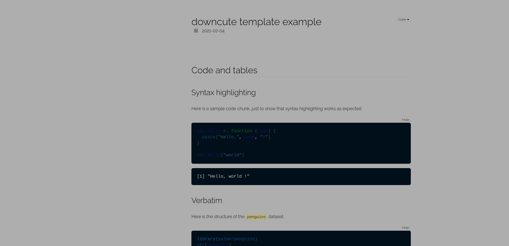
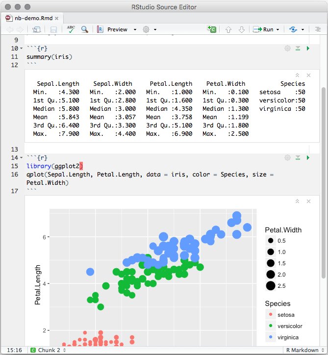

```{r setup, include=FALSE}
knitr::opts_chunk$set(echo = TRUE, message=FALSE, warning=FALSE , error=TRUE)
```

# Introdução

Na aula passada, fizemos uma rápida introdução ao R. Nas aulas desta semana, vamos focar em dois tópicos. 

1. Uso de R Markdown para gerar relatórios dinâmicos, integrando texto e resultados de R. (Hoje). 

2. Boas práticas para fluxo de programa em R (Rprojects, como organizar suas pastas de trabalho, e pacote `Here`) (Quarta-Feira). 

# R Markdown. 

O R Markdown é uma sintaxe responsável por integrar **R** e o **Markdown**. Meio óbvio certo? 

O **R**, como sabemos, é uma linguagem de programação usada fortemente na ciência de dados e ciências sociais computacionais. O **Markdown** é uma linguagem desenvolvida para converter textos simples e com pouco estrutura (.txt) em documentos finais mais complexos, como uma página da web. 

Este integração - entre código em R e conversão de texto do Markdown - faz do **R Markdown** uma ferramenta poderosissíma e útil para nosso trabalho em ciência de dados e ciências sociais computacionais. Porquê? Em arquivo único de **R Markdown**, você pode:

- Salvar, Executar e Visualizar Códigos de R. 

- Gerar relatórios dinâmicos de altíssima qualidade. 

Por exemplo, este tutorial, e todos os materiais do curso foram criados utilizando **R Markdown**. 

## R Markdown: Um passo em direção a maior transparência e reproducibilidade da Ciência. 

Uma vantagem importante do uso de **R Markdown** está em sua capacidade de ampliar a transparência de nossas análises e pesquisas científicas. 

Um relatório em **R Markdown** deve ser por essências auto-suficiente e reproduzível. Isto significa que, em teoria, se eu receber seus dados e o seu código em R Markdown, eu devo conseguir reproduzir exatamente seus próprios resultados. 

Pensem nos exercícios de vocês. Ao responder os seus exercícios, nada do que você adiciona em suas respostas pode ser produzido por fora da sua análise em R. Ao corrigir seu exercício, eu tenho acesso imediato ao seu código, ao seu output, e as suas explicações. 

Mais transparência é fundamental para produzirmos ciência de qualidade. Por isto, o R Markdown é uma ferramenta bastante utilizada hoje em dia. 


# Como funciona o R Markdown?

Este documento abaixo é um arquivo de **R Markdown**. Documentos de R Markdown possuem terminação `.rmd`, e são apenas arquivos simples de texto.

```{r, comment=NA, echo=FALSE}
cat(htmltools::includeText("example_markdown.Rmd"))

```

Este documento possui três componentes: 

- YAML Header: As primeiras linhas entre `---` e `---`

- Chuncks de Código de R: Linhas entre ```{} e ```. 

- Texto fora dos códigos e misturado com marcações como `#` e `***`

## YAML Header (Formato).

O YAML controla o formato, estilo e informações gerais do seu documento em Markdown. Por exemplo:

```{r eval=FALSE}
---
title: "example_markdown"
author: "Tiago Ventura"
date: "2/8/2021"
output: html_document
---
```

Há diversas alterações básicas que você pode fazer diretamente no YAML: o título do documento, o autor, a data. Além disto, você pode alterar o output. Este código abaixo vai gerar um pdf, ao invés de um html. 

```{r}
---
title: "example_markdown"
author: "Tiago Ventura"
date: "2/8/2021"
output: pdf_document
---

```


### Templates

Há diversos templates pré-construídos de R Markdown para você gerar documentos on-line. Estes templates são instalados como pacotes em R, e alteram a informação do YAML para produzir formatos diferentes dos documentos. 

Por exemplo, eu sou um fã dos templates criados pelo pacote `rmdformats`. Veja algumas opções [aqui](https://github.com/juba/rmdformats). Vamos primeiro instalar o pacote. 

```{r eval=FALSE}
install.packages("rmdformats")
```

Em seguida, você pode criar documentos com formato distintos e super bem formatos. Por exemplo: este YAML gerará um html no estilo `down_cute`

```{r eval=FALSE}
---
title: ""
date: "`r Sys.Date()`"
output:
  rmdformats::html_clean:
---
```

```{r}

```

Eu aconselho a não alterar o YAML diretamente quando você estiver ainda aprendendo a programar. Você pode usar novos formatos via RStudio: `file -> new_file -> R Markdown -> from template`. 

## Chuncks (Código)

Para executar o código dentro de um documento **R Markdown**, você fará uso dos "chunks". Estes "chuncks"  são pedações de código de R dentro de um documento de texto. 

Os "chunks" começam com um cabeçalho que consiste em $```{r}$ e o final do bloco é indicado por um $ ```$. Tudo entre estes dois sinais são lidos como um script de R. Você executar o código dentro de cada chunck usando o atalho de teclado que aprendemos anteriormente: `Cmd / Ctrl + Enter`. 

Para criar um "chunk" novo, você pode usar o atalho: `Cmd / Ctrl + alt + i`. Ou usar o botão insert + R no topo a direita do seu script. 

Ao executar um "chunk", o resulto aparecerá em uma tela a seguir do seu código. Este será o resultado final a ser incluso no seu documento de **R Markdown** 

```{r}

```

## Texto (Escrita)

Textos em **R Markdown** utilizam, como o nome diz, a sintaxe do Markdown. Como falamos antes, o Markdown é uma linguagem simples, level, e que utiliza determinadas marcações para compilar documentos mais complexos. 

Estas são as regras mais simples de Markdown

```{r, eval=FALSE}

Text formatting 
------------------------------------------------------------

*italic*  or _italic_
**bold**   __bold__
`code`
superscript^2^ and subscript~2~

Headings
------------------------------------------------------------

# 1st Level Header

## 2nd Level Header

### 3rd Level Header

Lists
------------------------------------------------------------

*   Bulleted list item 1

*   Item 2

    * Item 2a

    * Item 2b

1.  Numbered list item 1

1.  Item 2. The numbers are incremented automatically in the output.

Links and images
------------------------------------------------------------

<http://example.com>

[linked phrase](http://example.com)


Tables 
------------------------------------------------------------

First Header  | Second Header
------------- | -------------
Content Cell  | Content Cell
Content Cell  | Content Cell
```

A melhor maneira de aprender isso é simplesmente experimentá-los. Levará alguns dias, mas logo você escreverá tão facilmente quanto usando word. 

Se você se esquecer, pode obter uma folha de referência útil em  `Help > Markdown Quick Reference`

## Compilando. 

Após você finalizar seu documento (definir a YAML, escrever seus códigos, e escrever o texto), você precisa compilar todas essas informações em um documento unificado a ser convertido para html, pdf, ou doc. 

Para compilar, você pode manualmente apertar no botão `knit` no topo do seu código.  

Muitas vezes, o simples ato de compilar o documento, pode retornar erros. Aqui vão alguns dos erros mais comuns:

#### Erros Comumns

1. Você não instalou ou ativou um determinado pacote. 

2. Você está acessando um banco de dados, e seu endereço (path) está equivocado. 

3. Você apagou um objeto no meio do documento, e depois tenta acessá-lo de novo. 

#### Sugestões 

1. Sempre cheque seu path. O RMD usa a sua localização como diretório de trabalho no processo de compilamento. 

2. Leia as mensagens de erro com calma, e verifique em qual linha, ou chunk, está o erro.

3. Rode primeiro todos os chunks de código. Verifique se há algo errado, e corrija. 

4. Não desista! Use o google. 

## Opções dos Chunks. 

Os "chunks" de código possuem diversas opções de customização. Estas opções são bastante úteis quando estamos trabalhando em documentos mais complexos. 

Essas opções são incluídas no nome do "chunk", separado por vírgulas. Por exemplo:

```{r eval=FALSE}

#```{r, echo=FALSE, warning=FALSE, error=FALSE}
#```

```


Segue abaixo uma tabela sintetizando as opções dos chunks. De longe, as mais úteis são:

- `eval=FALSE`: seu código é adicionado ao documento final, porém não é avaliado pelo R. 

- `echo=FALSE`: seu código não é adicionado ao documento final, porém é avaliado pelo R. 

### Tabela de Opções dos Chunks. 

Option             | Run code | Show code | Output | Plots | Messages | Warnings 
-------------------|----------|-----------|--------|-------|----------|---------
`eval = FALSE`     | X        |           | X      | X     | X        | X
`include = FALSE`  |          | X         | X      | X     | X        | X
`echo = FALSE`     |          | X         |        |       |          |
`results = "hide"` |          |           | X      |       |          | 
`fig.show = "hide"`|          |           |        | X     |          |
`message = FALSE`  |          |           |        |       | X        |
`warning = FALSE`  |          |           |        |       |          | X


# Exercício. 

## Questão 1. 

Encontre um formato de R Markdown na internet. Pode ser qualquer template, com exceção do pacote básico. Instale o pacote e gere um documento em html com este formato. 

## Questão 2. 

Crie um arquivo .csv, salve no seu computador, abra ele usando um arquivo .rmd, e extraia um sumário deste arquivo. 


## Questão 3.

Crie um arquivo .rmd, compile como um html. Este arquivo precisa ter: i) um gráfico isolado - sem o chunk aparecendo no output final - e, ii) um chunk somente com códigos, em que os resultados não aparecem no documento (html ou pdf) final. 


