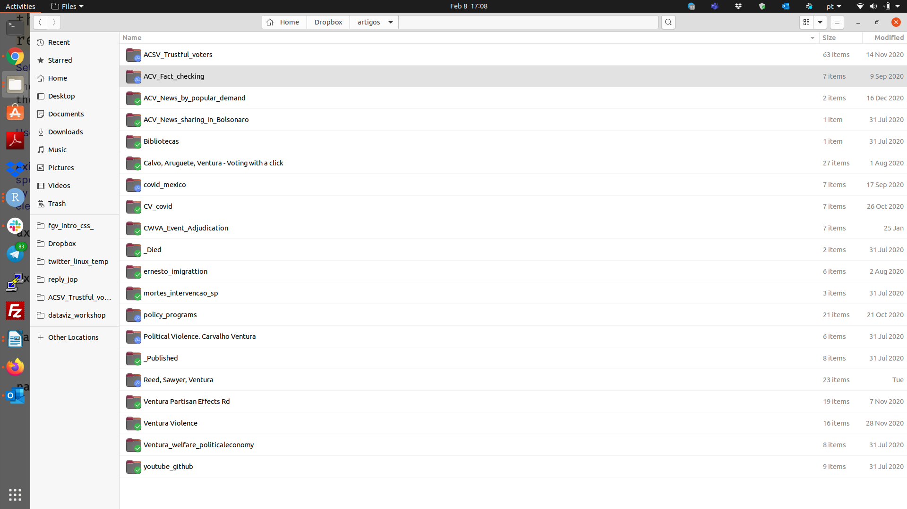

```{r setup, include=FALSE}
knitr::opts_chunk$set(echo = TRUE, message=FALSE, warning=FALSE , error=TRUE)
```

# Introdução.

Na aula passada, discutimos sobre o uso do **R Markdown** para geração de relatórios dinâmicos, documentos de alta qualidade estética, e produção de pesquisas mais transparentes e reproduzíveis. 

Hoje vamos discutir um pouco de boas práticas para fluxo de trabalho em R. Em especial, discutiremos como utilizar Rprojects para organizar seu ambiente de trabalho, como organizar suas pastas no seu computador, e como integrar melhor o funcionamento do R com a produção de artigos acadêmicos. 


# O que existe no seu R?

Em geral, quando começamos a programar, pensamos que o que é real no R é aquilo que conseguimos abrir. É quase uma idéia sensorial de que precisamos ver, ter um nome, tocar, para saber que algo existe em R. 

Isto em geral nos leva a crer que objetos salvos em nosso ambiente de trabalho são nosso mundo real de **R**. No entanto, esta é uma idéia ilusória, e muito capaz de gerar erros e trabalhos maiores em sua dinâmica de programação.

O ideal é pensarmos que o que existe de real em nossa rotina de programação são os nossos scripts. Precisamos ter a idéia de que, se eu precisar desligar meu computador hoje, amanhã este script me retornará exatamente ao ponto em que eu parei no dia anterior. 

Esta noção de script como o **real** do R guiará a aula de hoje. Para que nosso script seja real, minha sugestão é pensarmos nosso trabalho em R como um projeto auto-contido. Para isto perseguiremos três objetivos. 

1. Meu script precisa ser reproduzível - por mim, por mim daqui há seis meses, por meu co-autores, ou colegas de profissão que lerão meu script. 

2. Meu script precisa ser de fácil compreensão - por mim, por mim daqui há seis meses, por meu co-autores, ou colegas de profissão que lerão meu script. 

3. Todas as dependências e resultados dos scripts precisam estar devidamente ordenados e organizados. 

4. O seu projeto não deve ter absolutamente nenhuma dependência externa.

Veremos a seguir algumas formas de implementar estes três princípios. 

# Como organizar meus arquivos?

### Regra 1: Cada Projeto = Uma Pasta

Crie uma pasta para cada projeto. Por exemplo, segue abaixo um foto de como organizo todos os artigos que estou escrevendo:

```{r}

```


### Regra 2: Crie subpastas relevantes. 

- /resultados

- /codigos

    - analysis_x
    - build_x
    - visualizacao_x

- /leituras

- /artigo
  
    - rmd?
    - .tex?
    - .doc?

- /dados 

    - dados brutos
    - dados processados. 
    
#### Boas Práticas

1. Nunca crie pastas ou arquivos com espaços. 

2. Use nomes intuitivos, e que lhe ajudem a lembrar o que cada documento faz. 

3. Divida seus códigos em multiplos arquivos (análise, limpeza, gráficos). 

### Regra 3: Remove Dependências Automáticas do R. 

O **R** por default vem com uma opção de restauras seu ambiente de trabalho anterior. Esta opção é péssimas para produzir projetos auto-contidos, e reproduzíveis. 

Vamos retirar isso: `Tools > Global Options.`

- Desmarque `Restore .RData into workspace at startup`.
- Selecione NEVER para `saving workspace option`.
    

### Regra 4: Crie um Projeto de R. 

Cada um dos seus projetos deve ter um Rproject associado. Esta prática descrita acima é tão comum, que a equipe do RStudio criou um tipo de arquivo chamado `R Project` que permite justamente você ter um ambiente de R dedicado para cada um dos seus projetos distintos. 

O uso de `R Projects` é super útil quando integramos o R com outras plataformas, como o Git e Github. Não veremos isto nesse nosso curso. Por isto, em nosso caso, a principal contribuição do `R Projects` será em integrar nosso ambiente em R com cada um dos nossos projetos específicos. 

Por exemplo, siga os passos abaixo para ver algumas das vantagens do `R Projects`. 

1. Crie um arquivo de R project para a pasta da Regra 1 acima. `file > new project > existing directory`

2. Crie um script novo e salve dentro desta pasta. 

3. Feche o R Studio. 

4. Abre a pasta de seu projeto, e clique no arquivo .rproj


Ao abrir o R Studio você verá que seu ambiente de trabalho está restaurado sem nenhuma dependência, no entanto, você é trazido de volta para onde parou, seus scripts abertos, história dos últimos comandos salva, e mais importante, diretório de trabalho definido no local onde está salvo o .rproj. 


Rode as funções abaixo em seu R, com seu R Project aberto. 

```{r eval=FALSE}
list.files()
getwd()
```

### Como seguir este fluxo sem fazer point-and-click?

As funções abaixo implementam o passo a passo acima diretamente do seu R. 

#### Crie um R Project

file > new project > new directory

#### Onde Estamos

```{r eval=FALSE}
getwd()
```

#### Crie suas subpastas

```{r eval=FALSE}
dir.create("dados")
dir.create("resultados")
dir.create("codigo")
dir.create("leituras")
dir.create("doc")
```

### Regra 5: Use o Pacote Here. 

Quando começamos a programar, somos ensinados a usar a função `setwd()` para definir nosso diretório de trabalho, ou como falamos semanas atrás, onde o R está olhando. 

A maioria dos códigos que você recebe amigos e professores contêm o seguinte comando nas primeiras linhas:

```{r}
setwd("tiago/wd/dropbox/arquivo/aula")
```

No espírito de termos um projeto auto-contido, vamos evitar utilizar a função setwd(). Porque? Porque a pasta (path) do seu computador nunca será igual a minha. Por isso, por definição, seu código nunca será reproduzível em meu computador. 

Para substituir o `setwd()`, vamos usar uma solução super prática. Vamos combinar o o R Projects, que automaticamente redefine meu diretório de trabalho, como o pacote `here` que nos oferta uma forma mais fácil de encontrar nossos arquivos. 

```{r}
#install.packages("here")
library(here)
here()
```

Vamos criar uma pasta nova:

```{r}
list.files()
dir.create(here("exemplo_para_aula"))
list.files()
```

Vamos salvar um gráfico nesta pastas. 

```{r}
library(tidyverse)
ggplot(mtcars, aes(x = mpg, y = wt)) +
   geom_point()
ggsave(here("exemplo_para_aula", "grafico.png")) # endereço , nome do arquivo
list.files(here("exemplo_para_aula"))
```

Ou seja, o `here` encontra seu R Projects, e usa ele como diretório de um nível maior. A partir daí, você acessa todos os níveis inferiors usando os nomes das subpastas. 

Mais importante, quando você compartilhar seu projeto, com as subpastas, e o R projects, todos os seus códigos devem ser plenamente reproduzíveis justamente pela combinação entre .`rproj` e o pacote `here`. 

 
# Exercício 

Crie uma pasta para o nosso curso seguindo as regras acima discutidas. 


