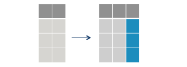

```{r setup, include=FALSE}
knitr::opts_chunk$set(echo = TRUE, 
                      message=FALSE,
                      warning=FALSE , 
                      error=TRUE)
```

# Introdução.

Nas nossas duas primeiras semanas de aula, focamos em uma introdução básica ao R e a comunicar nossos resultados usando relatórios dinâmicos e de alta qualidade via RMarkdown. 

Pelas próximas três semanas, focaremos em três habilidades centrais para nosso trabalha enquanto cientista social computacional: i) manipulação de banco de dados, b) visualização de dados, e c) programação funcional. 

Para aprender estas três habilidades, faremos uso dos pacotes do `tidyverse`. 

# Tidyverse

O `tidyverse` é uma família de pacotes em R. Estes pacotes foram e são desenvolvidos de forma integrada, compartilhando uma mesma filosofia de design, gramática e estruturas de dados subjacentes. Portanto, se você aprender um, os outros pacotes ficarão mais fáceis.

O objetivo do `tidyverse` é prover um conjunto integrado de ferramentas para o uso do R como linguagem em Ciência de Dados. O que signifca que os pacotes do `tidyverse` cobrem temas como manipulação de dados, visualização, preparação, modelagem, limpeza, entre outros. Estes são os principais pacotes do `tidyverse`:

- `dplyr`: para manipulação de dados.

- `ggplot2`: para visualização de dados.

- `tidyr`: para preparar seus dados para análise. 

- `purrr`: para otimizar seu código e para programação funcional.

- `readr`: para abrir e organizar os dados. 

- `stringr`: para manipulação de objetos de texto. 

- `forcats`: para manipulação da classe fatores. 


## Porque devo usar o tidyverse ?  

Você não **deve** usar o tidyverse. Porém, há diversas vantagens em usar os pacotes do tidyverse para sua dinâmica de trabalho em R. Algumas delas são:

- O `tidyverse` facilita substancialmente as tarefas de análise de dados quando comparado com códigos do  R básico. 

- Aumenta substancialmente quão legível seu código parece.

- Manipulação, visualização e modelagem estão integradas no tidyverse. 

- É amplamente utilizado na comunidade de R. Portanto, provavelmente você precisa aprender para ler códigos de outros colegas.

No tutorial de hoje, faremos uma breve introdução ao `tidyverse` e em seguida focaremos no uso do do `dplyr` para manipulação de bancos de dados. 

# Entrando no Tidyverse

## Instalação. 

O primeiro passo é instalarmos o `tidyverse`. Com um comando, estamos instalando dezenas de pacotes em nosso R. 

```{r eval=FALSE}

install.packages("tidyverse")

```

```{r}
library(tidyverse)
```

## Tibbles. 

O objeto fundamental do `tidyverse` são bancos de dados. Sendo um pacote desenvolvido para ciência de dados, manipulação e visualização, todos os pacotes do `tidyverse` são desenvolvidos para funcionar com formatos básicos de banco de dados. 

O `tidyverse` usa objetos da classe "tibbles" para definir seus bancos de dados ao invés do tradicional data.frame, que aprendemos semana passada. Tibbles são exatamente iguais a banco de dados em sua estrutura básica, no entanto, tibbles possuem alguns ajustes para facilitar sua aplicabilidade. 


### Criando Tibbles. 

```{r}

# Classe do Banco de Dados mtcars
class(mtcars)

# Converte para tibbles
mtcars_tib <- as_tibble(mtcars)
mtcars_tib
```


## Pipe.


```{r out.width="60%"}
knitr::include_graphics("figs/pipe.jpg")
```

O uso de pipes `%>%` é uma peça fundamental no funcionamento dos pacotes do `tidyverse`, em particular para processos de manipulação de bancos de dados.  

O `%>%`permite a você concatenar, conectar em cadeias as funções do seu código. Esta conexão faz com que nossos códigos se tornem mais intuitivos e fáceis de serem lidos e interpretados. 

Para entendermos a utilidade dos pipes, é bom perceber primeiro como o R conecta operações distintas. 

O R funciona de dentro para fora:

```{r}
# R
x <- c(1:10)
round(exp(sqrt(mean(x))), 1)

```

o `%>%` conecta estas operações em ordem lógica:

```{r}
x %>%
  mean() %>%
  sqrt() %>%
  exp() %>%
  round(1) 
```

### Notas importantes sobre os pipes. 

#### 1. Os pipes sempre devem ser usados para conectar funções e seus outputs.

```{r eval=FALSE}

# Não rode este código.
x %>%
  funcao1(arg1=x) %>%
  funcao2(arg=output_da_funcao1)
```

**Exemplo:**

```{r}
sample(1:1000, 500, replace=TRUE) %>%
  density() %>% # funcao 1.
  plot() # função 2. 
```


#### 2. O input sempre pode ser omitido, ou representados pelo atalho `.`

```{r}
sample(1:1000, 500, replace=TRUE) %>%
  density(.) %>% # funcao 1.
  plot(.) # função 2. 
```

#### 3. Os resultados do pipe não são salvos imediatamente. Você precisa atribuir à um novo objeto. 

```{r}
grafico <- sample(1:1000, 500, replace=TRUE) %>%
              density(.) %>% # funcao 1.
              plot(.) # função 2. 
```


## Desafio. 

Reescreva o código abaixo utilizando o `%>%`.

```{r}
library(tidyverse)

x <- "cpdoc"
x <- str_to_upper(x)
x <- str_c(x, "-FGV")
x <- str_to_title(x)
x
```

# Manipulação de dados com `dplyr`.

A partir deste ponto, focaremos no pacote `dplyr` para manipular e transformar banco de dados. Vamos utilizar dados eleitorais do Brasil, extraídos a partir do pacote [`cepespR`](https://workshop.cepesp.io/acessar/), para tornar nosso aprendizado mais intuitivo 

## Dados Eleitorais: cepespR

```{r eval=FALSE}
if (!require("devtools")) install.packages("devtools")
devtools::install_github("Cepesp-Fgv/cepesp-r") 
```

```{r}
library(cepespR)
library(tidyverse)

pres_rio <- get_votes(year = 2018, 
                         position = "Presidente", 
                         regional_aggregation = "Municipio", 
                         state="RJ") %>%
                  as_tibble()

```

### Informações básicas

```{r}
glimpse(pres_rio)
```


## Introdução ao Dplyr. 

O `dplyr` é um dos pacotes mais populares em R. Sua lógica é simples: suas funções fazem exatamente o que seus nomes descrevem (**verb based language**). Seu uso torna nosso código mais intuitivo de seguir, entender e ler. Veja alguns exemplos. 

Estas são as funções mais úteis do `dplyr`:

- `select()`: selecionar colunas.

- `filter()`: filtrar o banco de dados por linhas.

- `mutate()`: criar novas variáveis e alterar existentes.

- `arrange()`: ordenar o banco de dados.

- `group_by()`: agrupar e fazer análiser nos subgrupos. 

- `summarize()`: sumariza os dados por subgroups. 

**Algumas outras funções menos utilizadas**:

- `count()`: contar número de observações por subgrupos.

- `distinct()`: eliminar repetições.

- `n():` conta quantas observações há em dados agrupados.

- `sample_n():` Selecion n amostras do seu banco de dadosl

- `glimpse():` Fornece um sumário dos seus dados. 

- `top_n():` Seleciona por linhas de acordo com o rank das variáveis.

- `slice()`: filtra seu banco de dados por posições. 


Todas essas funções seguem as mesmas características:

- O input é sempre um banco de dados. 

- O banco de dados é sempre o primeiro argumento. 

- Os argumentos seguintes acessão colunas dos bancos de dados diretamente, sem aspas. 

- O output é sempre um novo banco de dados. 

## Select: Seleciona Colunas. 

```{r echo=FALSE, out.width="60%"}
knitr::include_graphics("figs/select.png")
```


### Uso Básico. 


```{r}

pres_rio %>% # Dados
  select(ANO_ELEICAO, SIGLA_UE, NOME_MUNICIPIO, COD_MUN_IBGE) # colunas
```

### Reordenando Colunas

```{r}
pres_rio %>% # Dados
  # seleciona colunas
  select(QTDE_VOTOS, ANO_ELEICAO, SIGLA_UE, 
         NOME_MUNICIPIO, COD_MUN_IBGE) # colunas
```


### Renomeando Colunas

```{r}
pres_rio %>% 
  # seleciona colunas com novos nomes. 
  select(votos=QTDE_VOTOS, 
         ano=ANO_ELEICAO, 
         pais=SIGLA_UE, 
         mun=NOME_MUNICIPIO, 
         cod=COD_MUN_IBGE) # colunas
```


### Salvando Novo Banco. 

```{r}
rio_reduzido <- pres_rio %>% # Dados
                  # seleciona colunas com novos nomes. 
                  select(votos=QTDE_VOTOS, 
                         ano=ANO_ELEICAO, 
                         pais=SIGLA_UE, 
                         mun=NOME_MUNICIPIO, 
                         cod=COD_MUN_IBGE) # colunas
```

### Outros Atalhos para Uso do Select. 

- `contains()` - Extrai colunas que contêm determinado texto.

- `starts_with()` - Extrai colunas que inicia com determinado texto.

- `ends_with()` - Extrai colunas que termina com determinado texto. 

- `everything()` - Extrai todas as colunas restantes.

**Exemplos**

```{r}
pres_rio %>%
  # seleciona colunas onde NOME aparece
  select(contains("NOME"))
```

```{r}
pres_rio %>%
  # seleciona colunas que terminam com UF e 
  # todas as outras colunas restantes
  select(ends_with("UF"), everything())
```


## Filter: Filtra Linhas por Condições Lógicas. 


```{r echo=FALSE, out.width="60%"}
knitr::include_graphics("figs/filter.png")
```


### Uso Básico. 

      filter(data, coluna=="a")

```{r}
pres_rio %>%
  # filtra casos ondem partido igual a 17.
  filter(NUMERO_CANDIDATO==17) %>%
  # seleciona
  select(DESCRICAO_CARGO, NUMERO_CANDIDATO, QTDE_VOTOS, NOME_MUNICIPIO)
```

### Multiplas Condições

```{r}
pres_rio %>%
  # filtra usando or
  filter(NUMERO_CANDIDATO==17 | NUMERO_CANDIDATO==13, # or
  #filtra usando and
         NOME_MUNICIPIO=="Rio de Janeiro") %>% # and
  #selecion
  select(DESCRICAO_CARGO, NUMERO_CANDIDATO, QTDE_VOTOS, NOME_MUNICIPIO)
```

## Arrange: Ordena Linhas por Colunas.


```{r echo=FALSE, out.width="60%"}
knitr::include_graphics("figs/arrange.png")
```

---

### Arrange: Uso Básico.

    arrange(data, coluna)
    
```{r}
pres_rio %>%
  # filtra pelas linhas
  filter(NUMERO_CANDIDATO==13) %>% 
  # seleciona
  select(DESCRICAO_CARGO, NUMERO_CANDIDATO,
         QTDE_VOTOS, NOME_MUNICIPIO) %>%
  # ordena de forma crescente
  arrange(QTDE_VOTOS)
```

---

### Arrange: Decrescente    


```{r}
pres_rio %>%
  # filtra pelas linhas
  filter(NUMERO_CANDIDATO==13) %>% 
  # seleciona variáveis
  select(DESCRICAO_CARGO, NUMERO_CANDIDATO, 
         QTDE_VOTOS, NOME_MUNICIPIO) %>%
  # ordena em valores descrecentes
  arrange(desc(QTDE_VOTOS))
```

## Mutate: Adiciona uma nova coluna. 

```{r echo=FALSE,out.width="60%"}

```


### Uso Básico:

    mutate(data, nome_nova_coluna=valores_nova_coluna)

```{r}
pres_rio %>%
  # cria variável com estado e cidade
  mutate(estado_cidade=paste(NOME_MUNICIPIO, "-", NOME_UF)) %>%
  #seleciona para visualizar
  select(NOME_MUNICIPIO, NOME_UF, estado_cidade)
```

### Condicionais

```{r}
pres_rio %>%
  # cria variável usando condicionais
  mutate(estado_sigla=ifelse(NOME_UF=="Rio de Janeiro", "RJ", NA), 
  # concatena nova variável com cidade
         estado_cidade=paste(estado_sigla, "-", NOME_MUNICIPIO)) %>%
  #selectiona
  select(NOME_UF, NOME_MUNICIPIO, estado_sigla, everything())
```

### Operações Matemáticas. 

```{r}
pres_rio %>%
  # log dos votos
  mutate(log_votos=log(QTDE_VOTOS)) %>%
  # seleciona
  select(QTDE_VOTOS, log_votos)
```

## Group_by + Summarize. 

```{r echo=FALSE, out.width="60%"}
knitr::include_graphics("figs/group_by.png")
```

Uma tarefa muito comum quando manipulamos bancos de dados é calcular valores para determinados subgroups. Por exemplo:

- Qual a votação total dos candidatos a presidencia no Estado do Rio de Janeiro ?

- Qual o total de votos por município?

- Em qual micro-região Jair Bolsonaro saiu com maior vantagem? 

Para responder esta perguntas, faremos uso da função `group_by` + `summarize`. 

### Group_by

O primeiro passo é agrupar de acordo com a variável de nosso interesse. 

```{r}
pres_rio %>%
  # agrupando por candidato presidencial
  group_by(NUMERO_CANDIDATO) 
```

`group_by` somente agrupa seu banco. É como se criassêmos diversos mini-bancos de dados no background do R. A partir disso, podemos usar `summarize` para calcular valores de nosso interesse neste subgrupos. 

## Summarize.

```{r echo=FALSE, out.width="60%"}
knitr::include_graphics("figs/summarize.png")
```

## Uso básico:

    summarize(dados_agrupados, nome_nova_variavel=valores_calculados)
    
```{r}
pres_rio %>%
  # Somente primeiro turno 
  filter(NUM_TURNO==1) %>%
  # agrupando por candidato presidencial
  group_by(NUMERO_CANDIDATO) %>%
  # Somando os votos em todo o estado.
  summarise(voto_estado=sum(QTDE_VOTOS)) %>%
  # Ordena
  arrange(desc(voto_estado))


```
    
Perceba: **o `summarize` transforma múltiplas linhas em uma para cada subgrupo**

### Mais Exemplos

**Quem ganhou no Rio de Janeiro no Segundo Turno?**

```{r}
pres_rio %>%
  # Somente primeiro turno 
  filter(NUM_TURNO==2) %>%
  # agrupando por candidato presidencial
  group_by(NUMERO_CANDIDATO) %>%
  # Somando os votos em todo o estado.
  summarise(voto_estado=sum(QTDE_VOTOS)) %>%
  # Ordena
  arrange(desc(voto_estado))
```

**Total de Votos por Município**

```{r}
pres_rio %>%
  # Somente primeiro turno 
  filter(NUM_TURNO==1) %>%
  # agrupando por candidato presidencial
  group_by(NOME_MUNICIPIO) %>%
  # Somando os votos em todo o estado.
  summarise(voto_mun=sum(QTDE_VOTOS)) 
```

**Votos por Meso-Região**

```{r}
pres_rio %>%
  # Somente primeiro turno 
  filter(NUM_TURNO==1) %>%
  # agrupando por candidato presidencial
  group_by(NUMERO_CANDIDATO, NOME_MESO) %>%
  # soma de votos por município
  summarise(voto_media=mean(QTDE_VOTOS), 
            voto_min=min(QTDE_VOTOS), 
            voto_max=max(QTDE_VOTOS))
  
```

## Outras funções úteis. 

### Count: Contar por grupos. 

```{r}
pres_rio %>%
  # Quantas entradas para cada número candidato?
  count(NUMERO_CANDIDATO)
```

### Slice: Selecionar por posição das linhas. 

```{r}
pres_rio %>%
  slice(1:10)
```

### rowid_to_column() : criar id para linhas

```{r}
pres_rio %>% 
  rowid_to_column() %>%
  select(1:5)
```

## Desafio

### Mutate x Summarize. 

Qual a diferença entre as funções `mutate` and `summarize` ? Porque os dois exemplos abaixo geram resultados distintos?

```{r}

pres_rio %>%
  # Somente primeiro turno 
  filter(NUM_TURNO==1) %>%
  # agrupando por candidato presidencial
  group_by(NUMERO_CANDIDATO) %>%
  # Nova variável somando os votos em todo o estado.
  mutate(voto_estado=sum(QTDE_VOTOS))

```

### Praticando: 

Abra o banco de dados de candidatos a deputado federal no Rio de Janeiro. 

```{r}
dep_rio <- get_candidates(year=2018,
                          position="Federal Deputy") %>%
           as_tibble()
```

#### Responda:

1. Qual partido elegeu mais deputados? (3 linhas)

Dica: `data %>% filter(COD_SIT_TOT_TURNO==2 | COD_SIT_TOT_TURNO==3)` filtra somente os eleitos. 

```{r}

```

2. Qual candidato gastou mais recursos ? (2-3 linhas)

```{r}

```

3. Qual valor médio declarado de gastos de campanha de acordo com o gênero dos candidatos? (3 linhas)

```{r}

```


# Conectando Bancos de Dados com Dplyr. 

Raramente, você encontrará um banco de dados onde todas as informações da sua pesquisa estão contidas e prontas para serem analisadas.  

Na maioria dos casos, e por boas razões, bancos de dados possuem informações distintas, e os pesquisadores precisam conectá-los com vistas a construir o material necessário para suas análises. 

Este tipo de dados conectados a partir de várias tabelas são chamados de **dados relacionais**.  dados eleitorais no Brasil providos pelo TSE vem em pedaços distintos de informação, que podem a depender dos objetivos de sua análise ser conectados. De forma mais concreta, estes são alguns exemplos de bancos disponíveis no TSE

- **Candidatos**: arrecadação, nome, profissão, etc.

- **Votação**: dados de votação por município, zonal, seção eleitoral. 

- **Eleitorado**: perfil dos eleitores registrados no nível da zona eleitoral. 

## Chaves (keys)

Ainda nos casos dos bancos de dados do TSE, por exemplo, usando o número do candidato e a unidade eleitoral é possível conectar os bancos de **candidatos** e **votação**, ou usando o número da zona eleitoral por município, conectar **votação** e **eleitorado**. 


Estas variáveis capazes de conectar bancos de dados são chamadas **chaves**.  Estas **chaves** são:

- Completas. Nunca tenha missing values nas suas chaves. 

- Únicas: cada observação deve possuir uma chave distinta. Evite sempre duplicações. 

## Joins

Inspirado na linguaguem **SQL**, o dplyr possui um conjunto de funções com foco em conectar bancos de dados distintos. 

Vamos criar dois bancos bem simples para entendermos como estes joins funcionam. 

```{r}
data1 <- tibble(nome=c("A", "B", "C"), 
                value=c(10, 20, 30)) 
data2 <- tibble(nome=c("A", "D", "C"), 
                value2=c(10, 50, 30))
```

### left_join()

```{r echo=FALSE,out.width="60%"}
knitr::include_graphics("figs/left-join.gif")
```

```{r}
left_join(data1, data2)
```

### inner_join()

```{r echo=FALSE,out.width="60%"}
knitr::include_graphics("figs/inner-join.gif")
```

```{r}
inner_join(data1, data2)

```

### full_join()

```{r echo=FALSE,out.width="60%"}
knitr::include_graphics("figs/full-join.gif")
```

```{r}
full_join(data1, data2)

```

### Chaves Distintas?

Em inúmeros casos, os bancos que precisamos conectar terá nomes diferentes. Este problema é fácil de resolver. É preciso adicionar o argumento dos nomes, e ajudar as funções joins a fazerem seu serviço. 

```{r}
data3 <- data2 %>%
          # alterando o nome
          select(chave=nome, everything())

# Join

left_join(data1, data3, 
          by=c("nome"="chave")) # adicione argumento by.

```


### Desafio

Abra os bancos de dados de candidatos e votos do TSE. Faça um join entre eles, e salve o banco de dados.

- Quantas linhas este novo banco de dados possuí?

- Explique o número de linhas. 

```{r}
# Banco Candidatos
candidatos <- get_candidates(year=2018, position="President") %>% 
                as_tibble()

# Banco Votos
votos <- get_votes(year = 2018, position="President", state="RJ") %>%
            as_tibble()
# Join? 
```

```{r echo=FALSE, eval=FALSE}
cand_votes <- left_join(candidatos, votos, by=c("NUM_TURNO", "NUMERO_CANDIDATO"))

glimpse(cand_votes)
```


## Concatenando Bancos de Dados

Além de juntar bancos de dados usando chaves, podemos concatecar bancos verticalmente (pelas linhas) ou horizontalmente (pelas colunas). 

### bind_rows: por linhas

```{r}
bind_rows(data1, data2)
```

Note: ao conectar por linha, **as colunas precisam ter os mesmos nomes**. Caso não, você adicionará uma nova variável ao resultado final. 


### bind_cols: por colunas

```{r}
bind_cols(data1, data2)
```

Note: ao conectar por coluna, **as linhas precisam ter tamanho igual**.

