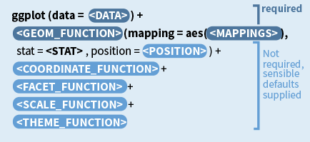

```{r setup, include=FALSE}
knitr::opts_chunk$set(echo = TRUE, 
                      message=FALSE,
                      warning=FALSE , 
                      error=TRUE, 
                      cache=TRUE)
```

# Introdução: Visualização de Dados com ggplot.

Nas semanas anteriores, cobrimos três tarefas fundamentais em R. Começamos com uma introdução básica ao R. Demos nosso segundo passo aprendendo a usar os pacotes do `tidyverse`. Neste ambiente, aprendemos a usar o `dplyr` para manipulação de dados, e conectar dados relacionais, e o `tidyr` para organizar nossos bancos de dados. 

Este semana vamos um passo adiante em nossa aprendizado. Aprenderemos sobre como utilizar o R para visualizar seus dados. Para isto, utilizaremos a pacote `ggplot`, que também faz parte do `tidyverse`. 

Este tutorial é inspirado no excelente livro  [Data Visualization:A practical introduction](https://socviz.co/index.html) de Kieran Healy.

# Porque investir em boas visualizações ?

Enquanto acadêmicos, uma das habilidades mais importantes que você precisa adquirir é a capacidade de comunicar de forma efetiva seus resultados, sejam esses simples dados exploratórios, até modelos estatísticos rebuscados. A meu ver,  mma visualização efetiva e bem pensada é sempre mais atraente do que uma tabela. O público em geral, incluindo nossos colegas acadêmicos, não saberão onde olhar e como analisar uma tabela cheia de números, enquanto um bom gráfico pode ser bastante intuitivo de seguir.


# Nosso itinerário. 

Para aprendar sobre visualização de dados, vamos percorrer os seguintes passos. 

1. Preparaçao de Dados: Porquê preciso dos meus dados Tidy?

2. Introdução ao ggplot: Geoms and Aesthetics

3. Acessários dos gráficos: labels, escalas, títulos, e outros. 

4. Casos Aplicados: reproduzindo gráficos de artigos acadêmicos. 


## Preparação dos Dados: Porquê preciso dos meus dados Tidy?

Ter seus dados em formato tidy é fundamental para o uso do ggplot. 80% do trabalho de visualização de dados está em preparar seus dados, os outros 20% é pensar quais dados utilizar e como botar em código. 

Nós aprendemos semana passsada, porém a guisa de revisão. As três propriedades mais importantes que definem um banco de dados `tidy` são:

- Cada coluna é uma variável. 

- Cada linha é uma observação. 

- Cada valor em uma linha.

Vamos ver estas regras visualmente:

{width=80%}


E porque é importante ter nossos dados em formato tidy quando pensamos em visualização? O ggplot funciona conectando colunas com visuais. E para fazer isto, precisamos de que cada coluna seja uma variável -- exatament como dados tidy são organizados. 


# Introducao ao ggplot. 

Visualização de dados envolve conectar (mapear) **variáveis** em seu banco de dados a **representações gráficas**. O `ggplot` fornece uma linguagem unificada para este processo de variáveis -> gráfico. Há outras formas e outros pacotes de visualização em R. O ggplot é uma destas linguagens.

### Grammar of Graphics.

O ggplot é baseado na [Grammar of Graphics](https://www.springer.com/gp/book/9780387245447). A grammar of graphics é uma linguagem desenvolvida para criar e descrever de forma unificada visualizações gráficas. Esta linaguem funciona com duas regras fundamentais:

- Os gráficos são construídos em camadas. 

- Cada variável precisa ser mapeada a uma representação gráfica. 

Segue abaixo uma visualização gráfica da **Grammar of Graphics.**. Discutiremos ao longo destas aulas cada uma das camadas de funcionamento da **Grammar of Graphics.**

{width=30%}

## ggplot: intuição.

O `ggplot` implementa o framework do **Grammar of Graphics** em R. Como esperado,  Cada gráfico é construído camada por camada: 

- Começando com seus dados, 
- Mapeamento Dados -> Visuais (aes), 
- Decisões geométricas (geoms) e,
- Embelezamento do gráfico (scale, theme e labels). 

E sua lógica fundamental funciona conectando **variáveis** a  **representações gráficas** por meio de uma função chamada __aesthethics mapping__ (aes). 

O gráfico abaixo de [Kieran Healy](https://socviz.co/makeplot.html#makeplot) resume bem a lógica:

{width=30%}


## ggplot: na prática.

Quatro "grande" etapas definem nosso trabalho de visualização:

1. **Etapa dos Dados**: Define qual banco de dados você pretende visualizar

2. **Etapa de Mapear**: Define quais **variáveis -> representações gráficas** você pretende visualizar. 

3. **Etapa de Geom**: Define como você pretende visualizar. 

4. **Etapa de Embelezamento**: Labels, escalas, coordenados, temas....


## Exemplo Básico.

Vamos ver um exemplo básico de como funciona o `ggplot` utilizando o banco de dados gapminder.  

#### Em abstrato



#### Com Dados.


```{r}
library(tidyverse)
library(gapminder)

ggplot(data=gapminder, ## Etapa dos Dados
       aes(y=lifeExp, x=gdpPercap)) + # Etapa de Mapear
      geom_point() # Etapa do Geom

```

# Geoms: Como queremos visualizar nossos dados? 

As `geom_function` controlam o tipo de gráfico que pretendemos visualizar. Por exemplo, gráficos de dispersão, barras, mapas, linhas, boxplots, densidade, cada tipo de gráfico representa uma `geom_function()` diferente. Vamos ver diversos exemplos a seguir. 


## Tipos de Gráfico: Uma variável. 


Todos estes gráficos necessitam desomente uma variável como input (no eixo x). Os valores do eixo y são calculados diretamente pelo `ggplot`, de acordo com o gráfico do seu interesse. Vamos ver alguns exemplos.  

### geom_density

Vamos gerar um gráfico simples de densidade. Vamos plotar a densidade dos valores de expectativa de vida usando os dados do `gapminder`.

```{r}
ggplot(data=gapminder,  # dados
        mapping=aes(x=lifeExp)) + # mapear
      geom_density() # forma geométrica
```

Customizar o gráfico usando as representações gráficas `fill` e `alpha`. 

```{r}
ggplot(data=gapminder,  # dados
        mapping=aes(x=lifeExp)) + # mapear
      geom_density(alpha=.5, fill="tomato2") # forma geométrica

```

### geom_histogram

Semelhante à densidade, porém, com histograms, os valores do eixo x são agrupados em intervalos (bins), e os valores do y são a soma de casos nestes intervalos. 

```{r}

ggplot(data=gapminder,  # dados
        mapping=aes(x=lifeExp)) + # mapear
      geom_histogram() # forma geométrica
```

Mais algumas customizações, utilizando as representações gráficas `color` e `fill` e ajudstando a largura dos intervalos em x. 

```{r}

ggplot(data=gapminder,  # dados
        mapping=aes(x=lifeExp)) + # mapear
      geom_histogram(bins=50, color="black", 
                     fill="lightgreen") # forma geométrica

```

## geom_bar (variável discreta)

`geom_bar` funciona da mesma forma que `geom_hist`, porém a variável `x` é categórica (discreta). Dessa forma, o `y` será a soma de observações em cada grupo presente em x. 

```{r}
ggplot(data=gapminder,  # dados
        mapping=aes(x=continent)) + # mapear
      geom_bar() 
```

Perceba, o eixo y é a soma de cada continente. Internamente, o `ggplot` usa o `group_by() + summarize()` para somar as observações em cada grupo. Isto é diferente de plotar dados já agrupados. Para isto, precisamos alterar o input de geom_bar. Por exemplo:

```{r}
g_grouped <- gapminder %>%
              count(continent)


ggplot(data=g_grouped,  # dados
       # adiciona o y
        mapping=aes(x=continent, y=n)) + # mapear
        # adiciona identity
        geom_bar(stat="identity")   

```


## Tipos de Gráfico: Contínua x Contínua.


### geom_point

Quando trabalhamos com duas variáveis contínuas, o uso de gráfico de dispersão (com pontos) é em geral a escolha mais intuitiva. Como esperado, este tipo de gráfico necessita de no mínimo duas variáveis (`x`e `y`), e ambas precisam ser contínuas. Vejamos um exemplo.


```{r}
ggplot(data=gapminder, ## Etapa dos Dados
       aes(y=lifeExp, x=gdpPercap)) + # Etapa de Mapear
      geom_point() # Etapa do Geom

```

Vamos alterar outras representações gráficas: `shape` altera a formato dos pontos e `size` controla  o tamanho dos pontos. 

```{r}
ggplot(data=gapminder, ## Etapa dos Dados
       aes(y=lifeExp, x=gdpPercap)) + # Etapa de Mapear
      geom_point(shape=22, alpha=.5, 
                 fill="tomato2", 
                 color="black", 
                 size=2) # Etapa do Geom

```


### geom_smooth

O `geom_smooth` adiciona uma curva para descrever de forma intuitiva o padrão de associação dos seus dados.

```{r}

ggplot(data=gapminder, ## Etapa dos Dados
       aes(y=lifeExp, x=gdpPercap)) + # Etapa de Mapear
      geom_smooth(fill="steelblue", 
                 color="black", 
                 size=1, alpha=.3) # Etapa do Geom

```

#### Múltiplos geoms. 

O gŕafico acima é pouco intuitivo sem a inclusão dos pontos em si. Lembre-se que o ggplot funciona em camadas, portanto, podemos facilmente combinar múltiplas formas geométricas em um único gráfico. Somente precisamos incluir todos os dados e variáveis nas nossas representações gráficas. 


```{r}
ggplot(data=gapminder, ## Etapa dos Dados
       aes(y=lifeExp, x=gdpPercap)) + # Etapa de Mapear
      
      # Pontos
      
    geom_point(shape=22, alpha=.2, 
                 fill="tomato2", 
                 color="black", 
                 size=2) + # Etapa do Geom

  
      # Tendência
    
      geom_smooth(fill="tomato2", 
                 color="black", 
                 size=1, alpha=.6) # Etapa do Geom

```


## Tipos de Gráfico: Discreta x Contínua.


### geom_boxplot

O `geom_boxplot` combina variáveis de tipo distintos. Utilizamos esta forma geométrica quando pretendemos apresentar um valor contínuo dividiso por outros valores categórico (grupos). O boxplot agrega esta variável contínua e apresenta de forma intuitiva sua dispersão e medida central de cada grupo (mediana). 

```{r}
ggplot(data=gapminder, ## Etapa dos Dados
       aes(y=lifeExp, x=continent)) + # Etapa de Mapear
      
      # Pontos
      
    geom_boxplot(fill="tomato2", 
                 color="black", 
                 size=1.5, 
                 alpha=.5)  # Etapa do Geom

```


# Representações Gráficas (aes)

Até aqui, usamos basicamente duas representações gráficas dentro das nossa função de mapear (aes): os eixos `x` e `y`. Intuitivamente, costumamos pensar nos eixos x e y como as únicas variáveis no banco de dados e consideramos outros elementos dos gráficos -- cores, transparência, formato -- como acessórios. 

Esta **não** é a forma como o `ggplot` funciona.

Todas as representações gráficas -- `color, fill, shape, alpha, linetype`, etc... -- podem ser mapeadas a variáveis do seu banco de dados. Este processo funciona adicionando mais elementos dentro da nossa função de mapear (`aes`). 


## Quais Representações gráficas (aes) estão disponíveis?


As principais representações gráficas são as seis acima apresentadas.

Cada uma destas representações combinará melhor com gráficos distintos, e com objetivos distintos da sua análise. 
Todas as variáveis que você pretende visualizar do seu banco de dados precisar ser mapeada em seu objeto do `ggplot`. Este mapeamento se dá a partir da função `aes()`. As suas representações gráficas não definem como você mostrará seus dados, mas somente o que você pretende mostrar e usando qual representação gráfica. 

Vamos ver alguns exemplos de como mapear variáveis -> representações gráficas. 


## Color: Para Colorir Dados Agrupados. 

```{r}

ggplot(data=gapminder, ## Etapa dos Dados
       aes(y=lifeExp, x=gdpPercap, # Etapa de Mapear
           color=continent)) + # Com fill
      geom_point() # Etapa do Geom

```

## Fill: Para Preencher Dados Agrupados.

```{r}
ggplot(data=gapminder,  # dados
        mapping=aes(x=lifeExp, fill=continent)) + # mapear
      geom_density(alpha=.5) # forma geométrica

```


```{r}
gap_grouped <- gapminder %>%
                group_by(year, continent) %>%
                summarise(m=mean(lifeExp, na.rm = TRUE))

ggplot(data=gap_grouped,  # dados
        mapping=aes(x=year, y=m, 
                    fill=continent)) + # mapear
      geom_bar(stat="identity", position="dodge") 

```

## Alpha e size: Para mostrar variação em valores. 

```{r}
ggplot(data=gapminder, ## Etapa dos Dados
       aes(y=lifeExp, x=gdpPercap)) + # Etapa mapear 
      geom_point(aes(alpha=pop, 
           size=log(pop))) + # addicionar representações gráficas
      geom_smooth(color="red") + # Etapa do Geom
      scale_x_log10()

```

## Shape

```{r}
gap_grouped <- gapminder %>%
                group_by(year, continent) %>%
                summarise(m=mean(lifeExp, na.rm = TRUE))

ggplot(data=gap_grouped, ## Etapa dos Dados
       aes(y=m, x=year, 
           shape=continent)) + # Etapa mapear 
      geom_point(size=3) +
      geom_line()
```


## Desafio:

Descreva o gráfico abaixo usando o que aprendemos do ggplot e grammar of graphics. 

- Quantas Variáveis?

- Quantas Representações Gráficas?

- Quais Geoms?

- Quais Representações Gráficas?


