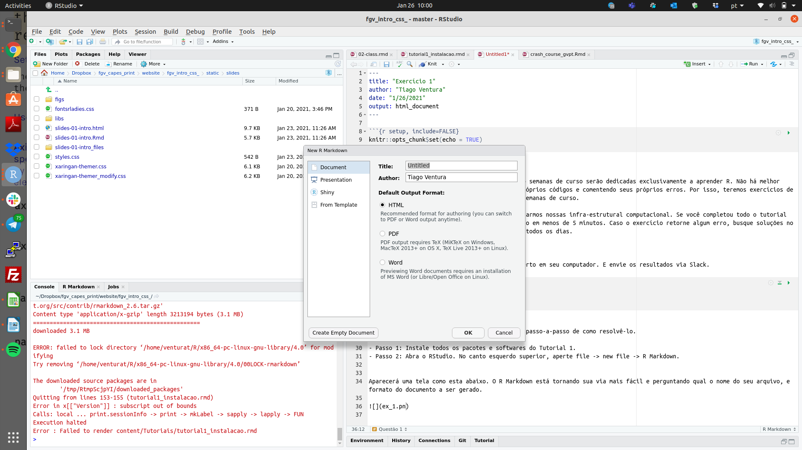

```{r setup, include=FALSE}
knitr::opts_chunk$set(echo = TRUE)
```

## Tutorial sobre os exercícios. 


Conforme explicado na ementa, as primeiras oito semanas de curso serão dedicadas exclusivamente a aprender R. Não há melhor forma de aprender do que praticando com seus próprios códigos e comentendo seus próprios erros. Por isso, teremos exercícios de R semanais ao longo das nossas primeiras oito semanas de curso. 

Baixe exercício em RMD [aqui](exercicio-1.rmd)

#### Quando devo entregar os exercícios?

Até que eu indique o contrário, o prazo para entrega dos exercícios é sempre sexta-feira, até meia noite. Exercícios entregues depois terão a nota reduzida. 

#### Onde devo entregar? 

Toda nossa comunicação será via nossa canal de Slack. Para entregar os exercícios, abra um chat privado comigo no slack, e entregue os exercícios. 


#### Como devo entregar? 

Os exercícios devem ser entregues em formato PDF, gerados a partir de um arquivo de Rmarkdown. Essa rotina será fundamental para vocês se familiarizarem com a geração de documentos dinâmicos em markdown. 

## Exercício 1. 

Este primeiro exercício será somente para nivelarmos nossas infra-estrutural computacional. Se você completou todo o tutorial de instalação, este exercício deve ser resolvido em menos de 5 minutos. Caso o exercício retorne algum erro, busque soluções no google -- eu programo em há 8 anos e faço isso todos os dias. 

## Questão 1

Copie e cole o código abaixo para o RStudio aberto em seu computador. E envie os resultados via Slack. 

```{r eval=FALSE}
sessionInfo()
installed.packages()[1:100]
```

### Solução 

Como este é nosso primeiro exercício, darei um passo-a-passo de como resolvê-lo. 

- **Passo 1:** Instale todos os pacotes e softwares do Tutorial 1. 
- **Passo 2:** Abra o RStudio. No canto esquerdo superior, aperte file -> new file -> R Markdown.


Aparecerá uma tela como esta abaixo. O R Markdown está tornando sua via mais fácil e perguntando qual o nome do seu arquivo, e formato do documento a ser gerado. Selection a segunda opção .pdf e altere o nome do arquivo para "exercicio 1"

```{r  echo=FALSE, out.width = "80%"}
 
```

Em seguida, abrirá um arquivo como este:

```{r  echo=FALSE, out.width = "80%"}
knitr::include_graphics("markdown.png") 
```

Este é um arquivo do tipo .Rmd, e vamos discutir este tipo de arquivo na semana três. Para completar o exercício, você não deve alterar o topo do arquivo. 

`---`
`title: "Untitled"`

`author: "Tiago Ventura"`

`date: "1/26/2021"`

`output: html_document`

`---`
Você pode alterar toda parte posterior. Os `##` indicam o início de uma sessão no texto. O chuncks de texto em cor cinza são códigos de R. 

- **Passo 3:** Adicione o exercício em um desses chuncks

- **Passo 4:** Clique na tab `Knit` no topo do seuscript. Essa função irá converter o arquivo .rmd para um .pdf. 

- **Passo 5:** Envie-me o pdf via Slack. 


#### Até a próxima!


