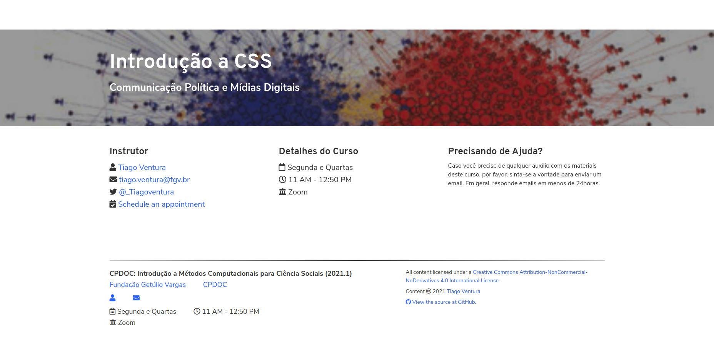
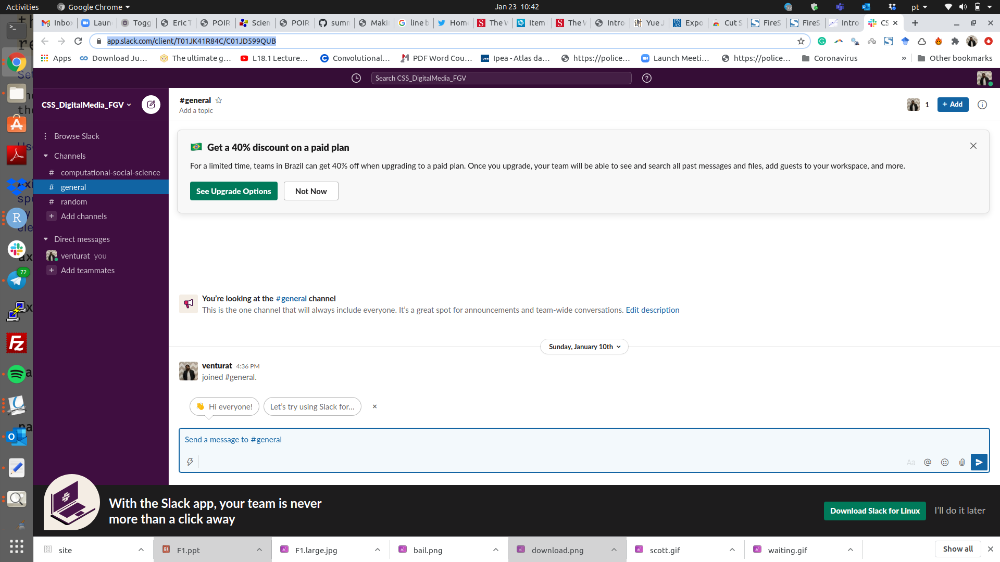

```{r setup, include=FALSE}
options(htmltools.dir.version = FALSE)
knitr::opts_chunk$set(message=FALSE, warning = FALSE)

``` 

## Como acompanhar o curso?

[https://fgvintrocss.netlify.app/](https://fgvintrocss.netlify.app/)
```{r  echo=FALSE, out.width = "100%"}
 
```


---

[Slack](https://app.slack.com/client/T01JK41R84C/C01JD599QUB)
```{r  echo=FALSE, out.width = "100%"}
 
```

---

## Escritório Virtual

Quarta-Feira, 15h- 16h. Nesta sala de Zoom. Não precisa enviar email. Só aparecer. 

## Monitoria

**Gabriela Kucuruza**

1. Email: [gabrielakucuruza@gmail.com](gabrielakucuruza@gmail.com)

2. Sessões Semanais:


---

class: center,middle, inverse

# Pausa, Respirem

# Leiam a Ementa, Visitem o Site

```{r echo=FALSE}
library(countdown)
countdown(minutes = 5, seconds = 0, top = 0,
          right = "30%",
          padding = "10px",
          margin = "5%",
          font_size = "5em")

```
--

### Perguntas

--


---

class: center, middle, inverse

# Respostas do Survey. 


---

## Familiariedade com R, Markdown e Git

--

1. A maior parte dos alunos se sente confortável em R

--

2. Domínio menor de Rmarkdown.

--

3. Pouco domínio em Git. 

--

4. Mais de 70% já fez um curso anterior em programação, e a maioria aqui no CPDOC. 

--

---

## Mais gostou da proposta do Curso

--

_A segunda parte do curso que envolve a teoria e a prática_

--

_De ser um curso de aprendizado continuo, sem ser necessariamente com X provas. Incentiva mais o aprendizado_

--

_busca e analise de dados de redes sociais_

--

_De realmente me ensinar a trabalhar com programação e raspagem de dados providos pelas redes sociais. O jornalismo de dados é um campo pelo qual tenho interesse._
--


---

## Menos Gostou da Proposta do Curso

--

_Confesso que não queria ver muito de antropologia não..._

--

_A literatura em inglês_

--

---

## O Que podemos Mudar?

--

_Se possível acrescentar leituras em português, pois alguns alunos podem ter problemas com leitura em outro idioma e isso dificultaria a participação nos debates em sala de aula._

--

_Talvez deixar livre trabalho em grupo ou individual_

--

_A melhoria já foi proposta, colocar coisas relacionadas a Antropolgia na aprendizagem, ou seja juntar quanti e quali._

--

_A literatura em inglês_


---

class:middle, center


## Serie de TV favorita?

--

```{r  echo=FALSE, out.width = "70%"}
knitr::include_graphics("https://media.giphy.com/media/Fm2nuxTGfKa1q/giphy.gif") 
```

--

---

class: middle, inverse, center


# Festival de Instalação

--

## [Tutorial](https://fgvintrocss.netlify.app/tutoriais/tutorial1_instalacao)

--

---

class: middle, inverse, center

## [Exercício 1](https://fgvintrocss.netlify.app/assignment/exercicio-1)


