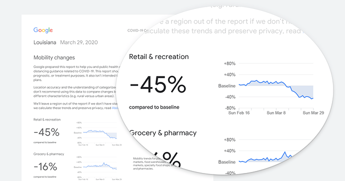
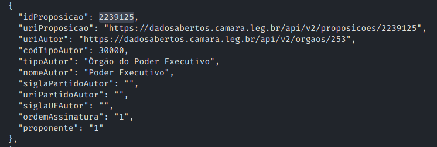
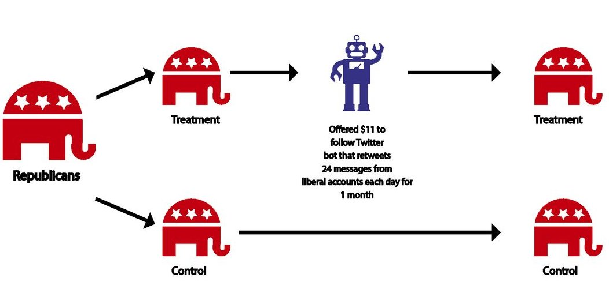

```{r setup, include=FALSE}
options(htmltools.dir.version = FALSE)
knitr::opts_chunk$set(message=FALSE, warning = FALSE)

``` 

class: center, middle

--

# Porque Estamos Aqui?

--

### Dados, Dados, Dados, Dados...

--
---

class: center, middle

```{r  echo=FALSE, out.width = "80%"}
knitr::include_graphics("figs/data_store.png") 
```

---

# Mobilidade Digital

```{r  echo=FALSE, out.width = "100%"}
 
```

---

# Redes Sociais

```{r  echo=FALSE, out.width = "100%"}
 
```

---

## Dados Eleitorais

```{r  echo=FALSE, out.width = "100%"}
knitr::include_graphics("figs/eleicoes.png") 
```

---

## Text-as-Data

.pull-left[
```{r  echo=FALSE, out.width = "100%"}
 
```
]

.pull-right[
```{r  echo=FALSE, out.width = "100%"}
knitr::include_graphics("figs/tweets.png") 
```
]

---

## Surveys On-line

```{r  echo=FALSE, out.width = "70%"}
knitr::include_graphics("figs/survey.png") 
```

---

class: center, middle

```{r  echo=FALSE, out.width = "100%"}
 
```

---

class: center, middle

--

# Porque Estamos Aqui II - O real talk?

--

### Melhores oportunidades e Mais Opções no Mercado de trabalho. 

--

---


## Ciências Socias na Era Digital: Vantagens.

- Abundância de dados de forma gratuita e fácil acesso. 

- Permite fazer novas perguntas.

- Ou encontrar novas respostas à perguntas antigas.

- Avanço Computacional: Novos métodos, computadores mais potentes, mais rápidos, e mais acessíveis. 

---

## Ciências Socias na Era Digital: Desafios.


-  Big Data requer mais treinamento técnico.

-  Cientistas da Computação se importam mais com performance.

-  Cientistas Sociais se importam mais com perguntas teóricamente relevantes.

-  Construir mais interdiciplinariedade e combinar técnica e teoria.


---

class: center, inverse, middle

## O objetivo do curso é apresentar ao alunos técnicas e desenhos de pesquisa de ponta no campo das Ciências Sociais Computacionais (CSS).

---
class: center,middle

## `Mas, afinal, o que é CSS?`

--

```{r  echo=FALSE, out.width = "70%"}
knitr::include_graphics("figs/waiting.gif") 
```
---

# Aprendendo com um exemplo.

```{r  echo=FALSE, out.width = "90%"}
knitr::include_graphics("figs/bail.png") 
```


---

# Desenho de Pesquisa


```{r  echo=FALSE, out.width = "90%"}
 
```


---

---

class: center,middle


#### Ciência de Dados não é suficiente sozinha se quisermos responder perguntas teóricamente orientadas

--

#### Cientistas Sociais isoladamente não possuem o conhecimento técnico para usar as novas bases de dados e métodos da era digital. 

--

---


### Ciência Social Computacional = Ciência Social + Ciência de Dados.

--

### Ciência Social

--

- Entender Compartamento Social.

- Big Questions.

- Dilemas do Comportamento Humano.

- Explicar Mudanças e Padrões na Sociedade.

- Em geral, manipulação de banco de dados pequenos ou médios. 

--

### Ciências de Dados

--

- Estuda qualquer assunto.

- Aprende diretamente dos Dados - Modelos Estatísticos e ML.

- Big Data.

- Predição de mudanças e comportamentos.

--


---
class: center, middle, inverse

# Intervalo 


```{r echo=FALSE}
library(countdown)
countdown(minutes = 15, seconds = 0, 
          right = "25%", bottom = "15%",
          margin = "5%",
          font_size = "5em")

```

---

## Vamos recomeçar sabendo um pouco mais de vocês

--

.pull-left[

Nome e Pronome Preferido. 

Departamento, Graduação, área de estudos. 

O que você pretende aprender neste curso ?

Quando e como começou seu interesse por este tema?

]

--

.pull-right[
```{r  echo=FALSE, out.width = "90%"}
 
```
]

--

---

# Quem sou Eu?

- Young Talent In Computational Social Science Fellow, FGV-CPDOC.
- Pronome: Ele-Dele.
- Doutorado em Ciência Política no IESP-UERJ.
- Estudante de Doutorado em Governo e Política na Universidade de Maryland.

#### Minhas Pesquisas:

- **Violência política:** Efeitos Comportamentais de Victimização no Brasil e México. 
- **Comunicação Política:** Ativação de Conteúdo e Notícias no Twitter, Efeitos de Framing, Confiança e Mídias Digitais ....
- **Política Brasilieira:** Participação Social, Política Local, Análise de Manifestos de Eleições Locais. 

### Contato:

- **Website:** [tiagoventura.rbind.io](http://tiagoventura.rbind.io/)

- **Email:** tiago.ventura@fgv.br
---


## Estrutura do Curso

#### Parte I: Programação em R. (Semana 1 - 8)

- Manipulação de Dados, Visualização, Automação e  Apresentação em R

- Raspagem de Dados na Internet


#### Parte II: Ciências Sociais Computacionais Aplicadas (Semana 8-14).


  - Anaĺise de dados de twitter

  - Experimentos de campo e experimentos digitais 

  - Análise de texto

  - Machine Learning


#### Parte III: Projeto Final Aplicado.

---

class:middle, center

## Avaliação

--

### Participação (10%)

--

### Exercícios (Semana 1 - Semana 8: 40%)

--

### Trabalho Final (50%)

---

class: center,middle, alert

# Não teremos provas

---

class: center,middle, 

# Os desafios de ensinar on-line em meio a uma pandemia.

---


## Como acompanhar o curso?

.pull-left[
[fgv-css.tiagoventura.rbind.io](fgv-css.tiagoventura.rbind.io)
```{r  echo=FALSE, out.width = "100%"}
knitr::include_graphics("figs/site.png") 
```
]

.pull-right[
[Slack](https://app.slack.com/client/T01JK41R84C/C01JD599QUB)
```{r  echo=FALSE, out.width = "100%"}
knitr::include_graphics("figs/slack.png") 
```
]

<br><br>


### Escritório Virtual

Quarta-Feira, 15h- 16h. Nesta sala de Zoom. Não precisa enviar email. Só aparecer. 

---

class: center,middle, inverse

# Pausa, Respirem

# Leiam a Ementa, Visitem o Site

```{r echo=FALSE}
library(countdown)
countdown(minutes = 5, seconds = 0, top = 0,
          right = "30%",
          padding = "10px",
          margin = "5%",
          font_size = "5em")

```
--

### Perguntas

--


---
class: center, middle

## Bom... Eu tenho perguntas. 

https://forms.gle/UxFipy1KjzMn9Sk3A


