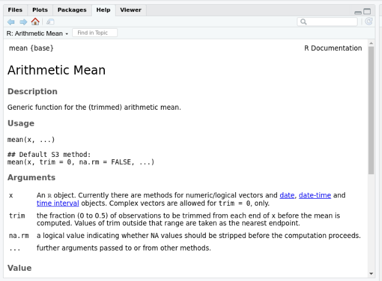

```{r setup, include=FALSE}
options(htmltools.dir.version = FALSE)
knitr::opts_chunk$set(message=FALSE, warning = FALSE, error = FALSE)

``` 

class: center, middle

# Introdução ao R: Parte I

---

# Logística: Exercícios. 

--

 1 - Exercícios todas as semanas (até a semana 8)

--

 2 - Entrega via Slack.

--

 3 - Regras para entrega atrasada: perde um ponto por dia de atraso. 

--

 4 -40% da Nota Final vem destes exercícios. 

--

---

# Logística II: Como acompanhar as aulas de programação?
--

1. Leia os tutoriais. 

--

2. Abra o RStudio e pratique com os códigos dos tutoriais. 

--

3. Pratique com as leituras indicadas e exercícios. 

--

---


# Tópicos de Hoje


1. Workflow: RStudio e Scripts.

2. Como Interagir com R.

3. Pacotes em R.

4. Ajuda em R.

5. Objetos e Classes

6. Operadores Booleanos

7. Estrutura de Dados

8. Manipulação Básica de Dados. 

9. Exportar e Importar Bancos de Dados. 


---

# O que é o R? Ou porquê o R?

* Software de código aberto.

* Superior (se não apenas comparável) às alternativas comerciais.

* Disponível em todas as plataformas (Unix, Windows, Linux).

* Como resultado de ser uma linguagem de dados aberta, se você fizer sua análise em R, qualquer pessoa poderá replicá-la facilmente.

* Não apenas para estatística, mas também **programação de uso geral**.

---

# RStudio.

O RStudio é a principal interface gráfica do usuário (GUI) e o ambiente de desenvolvimento integrado (IDE) que facilita o uso do R.

```{r  echo=FALSE, out.width = "100%"}
knitr::include_graphics("figs/R_vs_RStudio_1.png") 
```

.footnote[Fonte para figura: [Rochele Terman's Intro to CSS Book](https://plsc-31101.github.io/course/r-basics.html)]


---
# Navegando no R Studio

```{r  echo=FALSE, out.width = "100%"}
knitr::include_graphics("figs/rstudio.png") 
```


---
class: center, middle, inverse


# Como Interagir com R

---

# R Via Console (Tela Inferior Esquerda)

o prompt `>` aparece um símbolo maior que. Copie e cole o código abaixo em seu Console e click Enter.

```{r}
2+2
```

R usa `+` quando o código é dividido em várias linhas e R ainda espera mais código. 

```{r eval=FALSE}
# Este Código Retornará um +

incompleto <- "Eu sou um objeto incompleto
```

Uma linha de código geralmente não termina até que R encontre um parâmetro ou pontuação de parada apropriado que conclua algum código, como parêntese fechado fechado `)`, colchete `]`, colchete `}` ou aspas `` `

---

# R Via Script (Tela Superior Esquerda)

Abrir um script novo clicando na aba `File` -> `New File` -> `R Script`

O Script envia código diretamente para o console. 

--
#### `command + enter` (Mac) ou `Ctrl + enter` (PC) com o cursor na linha para rodar o script.  
--


```{r eval=FALSE}
# Rode estas operação em um script. 
# Hashtags permite você comentar seu código. 
2^2
2*2
2/2
```

---
class: center, middle, inverse

# Pacotes

---

# O que são pacotes?

--

- Um conjunto de funções organizadas em torno de um tema.

--

- As vezes provêm dados. 

--

- Uma pasta em seu computador.

--

- Um sinal de bondade de outros programadores.

--

- São instalados apenas uma vez: 
      
      `install.packages()`

--

- Ativados em toda sessão de R: 

  `library()`

---
class: center, middle

## Instalar Pacotes Via Cran.

```{r eval=FALSE}
install.packages("devtools", force=TRUE)
```


## Ativar um pacote. 

```{r eval=FALSE}
library(devtools)
```


## Instalar Pacotes Via Github. 

```{r eval=FALSE}
install_github("silvadenisson/electionsBR")
```


---
class: center, middle, inverse

# Funções de Ajuda. 

---

## Pedindo ajuda via R

```{r eval=FALSE}
# Ajuda específica.
?mean  # Help para a função mean.
help(mean)

# Ajuda mais geral: busca todas as ocorrências do nome da função. 
??mean

```

.center[
```{r  echo=FALSE, out.width = "70%"}
 
```
]

---

## Pedindo ajuda via Google.

- **Google**: nome do função/pacote + texto na mensagem de erro.

- Remova as informações específicas do usuário e dos dados primeiro!

- Veja se você consegue encontrar exemplos que produzem e não produzem o erro. Experimente o código de outras pessoas, mas tente entendê-los. Não copie e cole. 

- Tende entender a solução. Copiar e Colar não resolver seu problema. 


---
class: center, middle 

## A Regra dos 15 minutos

Retirado de  [Rochele Terman plsc-31101](https://plsc-31101.github.io/course/introduction.html).

```{r echo=FALSE, out.width = "50%"}
library(tweetrmd)
library(webshot)
tweetrmd::tweet_screenshot(tweet_url("math_rachel", "764931533383749632"))

```

---
class: center, middle, inverse

# Objetos em R. 

---

# O que são objetos ?


Peça base do R. Objetos são criados atribuindo determinado **dado** a um determinado **nome**, e você pode acessá-los exatamente por nome atribuído. 

`Tudo que existe no R é um objeto.`

---

## Criando Objetos

*(assignment operator)* `<-`

```{r}
# Variáveis Numéricas
x <- 5
y <- 7

# Variáveis de Texto.
nome <- "Tiago Ventura"

```

---

## Posso usar o `=` para criar objetos?

--

Sim. Mas...

--
.center[

]
--

### Qual o valor de x agora?


```{r eval=FALSE}
mean(x=c(5, 7))
```

---
class: center, middle 

## Outros Comandos Importantes

#### Verificar Ambiente de Trabalho

```{r}
ls()
```

#### Remover Objetos

```{r}
rm(y)
```

#### Visualizando objetos.

```{r}
print(nome)
```

#### Modificando objetos.

```{r}
nome <- "Tiago Augusto Ventura"
```

---
class: middle, center, inverse

# Classes de Objetos

---

## Classes em R

Casa objeto em R possui uma **Classe**. Em síntese, a classe descreve qual tipo de valores esse objeto está armazenando. Principais classes:

- Character 

- Numeric

- Interger

- Logical

---

## Resumo 

```{r echo=FALSE}
library(kableExtra)
library(tidyverse)
tibble::tribble(~ Example, ~ Tipo, 
                c("a", "swc"), "Character", 
                c(2, 3, 15), "Numeric", 
                c(1L, 2L), "Interger", 
                c(FALSE, TRUE), "Logical") %>%
  kbl() %>%
  kable_styling(bootstrap_options = c("striped", "hover", "condensed"))


```

---

## Descobrindo as Classes dos meus objetos. 

`class()`

```{r}
class(3)

class(TRUE)

meu_numero_da_sorte= "13"

class(meu_numero_da_sorte)

class(meu_numero_da_sorte==13)

```

---

## Outra forma: is.class?

```{r}
is.numeric(2)
is.logical(TRUE)
is.character("2")
is.integer(1L)
```

---

## Coerção: Alterando Classes. 

Classes de objetos em R também podem ser alteradas usando as funções `as.class()`

```{r}
# Cria Objeto
num_1_5 <- c(1, 2, 3, 4, 5)

# Altera a classe
char_1_5 <- as.character(num_1_5)

# Checando
class(char_1_5)
class(num_1_5)

# Ou
as.numeric("25")

```

---


# Desafio 1. 

Vamos praticar um pouco o que aprendemos até aqui. O que os comandos abaixo retornarão? Qual o resultado e porquê?


#### Questão 1:


```{r eval=FALSE}

install.packages(tidyverse)

```

#### Questão 2:

```{r eval=FALSE} 
false <- "FALSE"
false <- as.logical(false)
class(false)
```


#### Questão 3
```{r eval=FALSE}

mean(x = sample(1:50, 5)) == mean(x) # TRUE ou FALSE

```


```{r echo=FALSE}
library(countdown)
countdown(minutes = 5, seconds = 0, top = 0,
          right = 0,
          padding = "10px",
          margin = "5%",
          font_size = "3em")

```

---
class: center, middle, inverse

# Intervalo 


```{r echo=FALSE}
library(countdown)
countdown(minutes = 10, seconds = 0, 
          right = "25%", bottom = "15%",
          margin = "5%",
          font_size = "5em")

```

---

class: middle, center, inverse

# Estrutura de Dados

---

##  Vector

```{r}

# vetor de números
X <- c(1, 2.3, 4, 5, 6.78, 6:10)
X

# Class
class(X)

# Tamanho 
length(X)


```

---

## Matrix

**Principal característica:** Retangular e Números.

```{r}

# Coerce to a matrix
as.matrix(X)

# Cria uma Matrix do zero
matrix(1:10, nrow=5, ncol=2)

```


---

## List

**Principal Característica**: Tudo cabe dentro de uma lista e Iterável. 

```{r}

# coerce to a list

as.list(X)

# or

lista_1 <- list(X, as.matrix(X), as.character(X))

# Visualize a lista.

str(list)

```

---

# Data Frame. 

1. Banco de dados. 

2. Dados retangular. 

3. Comporta colunas de classes diferentes.

4. É um planilha de excel no seu ambiente R.

5. Class básica do R, diferente de outras linguagens. 

---


## Criando um banco de dados. 

```{r}

# Coercing
as.data.frame(X)

# Criando Manualmente

data <- data.frame(name=c("Tiago", "Tiago"), 
                   last_name=c("Ventura", "Ventura") ,
                   school=c("UMD", "FGV"), age=c(30,32))
data
```


---

## Bancos de Dados Pré-Construídos. 

```{r}
#devtools::install_github("apreshill/bakeoff")
library(bakeoff) # Chamando o pacote

# O que tenho no meu ambiente?
ls()

# ativa o banco de dados
data("bakers")
ls()

# Examine o objeto.
class(bakers)
str(bakers)
```

---

## Acessando dados em um Data Frame

**Pela Ordem da Coluna**

```{r}
bakers[,1] # primeira coluna
```

---

**Pela Nome da Coluna**

```{r}
bakers$age

# Ou

bakers[,"age"]

```

---

**Pela posição da linha**

```{r}
bakers[1:5, ]
```

---

**Por linha e coluna**

```{r}
bakers[1:5, "age"]
bakers[5:15, 3:5]
```
---

### Outras Funções Úteis

A classe data.frame possuí algumas funções pré-construídas bastante úteis. Alguns exemplos:

```{r eval=FALSE }

head(bakers) # Mostra primeiras cinco linhas

tail(bakers) # últimas cinco linhas

summary(bakers) # clase de cada coluna

dim(bakes) # dimensões de linha e coluna

glimpse(bakers) # outro modo de ver seus dados. 

```

---

### Operações Boolenas back, back, back again. 


```{r}
# Bakers com mais de 60 anos
bakers[bakers$age>60,]

#Bakers de Londers
bakers[bakers$hometown=="London",]

```

---

## Exportando banco de dados.

Uma função importante do R consiste em exportar seus resultados, incluindo um novo banco de dados. Há diversas funções para fazer isso, a depender do formato do output que você deseja. Alguns exemplos:

- `write.table()` for txt
- `write.csv()` for csv
- `write.xlsx` for xlsx
- `save()` to export as a RData

---

# Exportando como csv.

```{r eval=FALSE}
# make a fake data set

dfake <- data.frame(normal=rnorm(100, 0, 1), 
                    uniform=runif(100, 0, 1), 
                    pois=rpois(100, 10))

# write.function(data, name_to_be_saved)
write.csv(dfake, "dfake.csv")
```

---

### Mas... Onde estão meus dados? E onde R está olhando?

O `R` não sabe intuitivamente onde estão seus dados. Se os dados estiverem em uma pasta especial chamada "pesquisa super secreta", temos que dizer ao `R` como chegar lá.

Podemos fazer isso de duas maneiras:

--

1. Aprenda onde seus arquivos estão. 

--

2. Defina seu **diretório de trabalho** para essa pasta: todos seus outputs e inputs estarão lá.

--

---

## Paths

Toda vez que o `R` é inicializado, ele olha para o mesmo lugar (chamado de _global path_), a menos que seja solicitado a ir para outro lugar. 

```{r}
# Onde meu R está olhando?
getwd()
```

```{r eval=FALSE}
# Onde eu quero que olhe?
setwd("/home/venturat/Downloads")
```


---

## Importando dados. 

```{r}
# Checa diretorio
getwd()

# Ve arquivos neste diretorio.
list.files()

# Importa os dados. 
dados <- read.csv("dfake.csv")

head(dados)
```

---


# Desafio 2

Acima, quando filtramos o banco de dados bakers, usamos a seguinte função:

```{r eval=FALSE}
bakers[bakers$age>60,]
```

Me explique com o máximo de detalhes o que a linha de código acima está fazendo. Porque a operação booleana está antes da virgula? Qual o output da operação booleana?


```{r echo=FALSE}
library(countdown)
countdown(minutes = 5, seconds = 0, bottom = 0,
          right = 0,
          padding = "10px",
          margin = "5%",
          font_size = "3em")

```

---

# Nosso plano na próxima aula

- Funções.

- Iteração via Loops.

- Controle de Fluxo. 


## E não esqueção de olhar os tutoriais no site!

---


