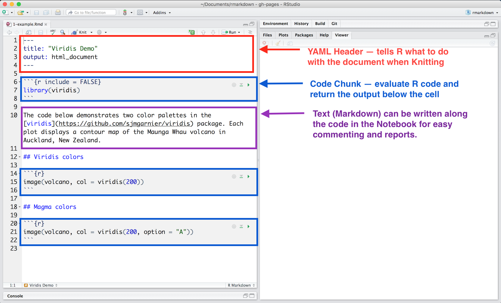
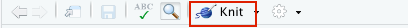

```{r setup, include=FALSE}
options(htmltools.dir.version = FALSE)
knitr::opts_chunk$set(message=FALSE, warning = FALSE, error = FALSE)

``` 

.pull-left[

# Semana Passada

1. Introdução ao R

2. Funções, Loops e Condicionais. 

.pull-right[

# Esta Semana

1. R Markdown (Relatórios Dinâmicos)
2. Fluxo de Trabalho em R (Boas Práticas)
3. R Projects

]

---
class: center, middle

# R Markdown

---
# R Markdown = R + Markdown

O R Markdown é uma sintaxe responsável por integrar **R** e o **Markdown**. Meio óbvio certo? 

Este integração - entre código em R e conversão de texto do Markdown - faz do **R Markdown** uma ferramenta poderosissíma.  Em arquivo único de **R Markdown**, você pode:

--

- Salvar, Executar e Visualizar Códigos de R. 

--

- Gerar relatórios dinâmicos de altíssima qualidades. 

--

- Documentos Transparentes e Replicáveis. 

--

---

# Como funciona o R Markdown?

```{r echo=FALSE}
knitr::include_graphics("figs/rmarkdown-1.png")
```

---

```{r echo=FALSE}
knitr::include_graphics("figs/rmarkdown-2.png")
```

---

```{r echo=FALSE}
knitr::include_graphics("figs/rmarkdown-3.png")
```

---

```{r echo=FALSE}

```

---


```{r echo=FALSE}
knitr::include_graphics("figs/rmarkdown-5.png")
```

---

# YAML Header

```{r eval=FALSE}
---
title: "example_markdown"
author: "Tiago Ventura"
date: "2/8/2021"
output: html_document
---
```

---

# Code Chunk

Os "chunks" começam com um cabeçalho abaixo: 

```{r}

# Exemplo de Chunk

```

Tudo entre estes dois sinais são lidos como um script de R. 

Executar o Chunk: `Cmd / Ctrl + Enter`. 

Criar um novo Chunk `Cmd / Ctrl + alt + i`.

Ao executar um "chunk", o resulto aparecerá em uma tela a seguir do seu código. Este será o resultado final a ser incluso no seu documento de **R Markdown** 

---

# Texto Markdown

.pull-left[

\# header I

\## header II

\*\*negrito\*\*

\*italico\*

\- Lista

\- Lista


]

.pull-right[

# header I

## header II

**negrito**

*italico*

- lista

- lista

]

<br>

**Lista de Ajuda:** `help > cheatsheets > R Markdown Reference Guides`


---

class:center, middle

# Exemplo 1: Homework em R Markdown. 

---

class: center, middle

# Exemplo 2: Tutorial em R Markdown.

---

# Templates

Há diversos templates, sobretudo para arquivos html, em R Markdown. Seguem alguns exemplos:

- [rmdformats](https://github.com/juba/rmdformats)

- [Notebooks](https://bookdown.org/yihui/rmarkdown/notebook.html)

- [Artigos](https://github.com/rstudio/rticles)


---

# Code Chunks Customizaçao.

Os "chunks" de código possuem diversas opções de customização.  Essas opções são incluídas no nome do "chunk", separado por vírgulas. 

```{r eval=FALSE}

#```{r eval=FALSE}


```

<br><br>

**Mais úteis**:

    - `eval=FALSE`: seu código é adicionado ao documento final, porém não é avaliado pelo R. 

    - `echo=FALSE`: seu código não é adicionado ao documento final, porém é avaliado pelo R. 


---

# Compilando. 

Após você finalizar seu documento (definir a YAML, escrever seus códigos, e escrever o texto), você precisa compilar todas essas informações em um documento unificado a ser convertido para html, pdf, ou doc. 

Para compilar, você pode manualmente apertar no botão `knit` no topo do seu código.

```{r}

```

---
# Desafio

<br><br><br>

.center-middle[
Crie um arquivo .rmd, compile como um html. Este arquivo precisa ter: i) um gráfico isolado - sem o chunk aparecendo no output final - e, ii) um chunk somente com códigos, em que os resultados não aparecem no documento (html ou pdf) final.
]


