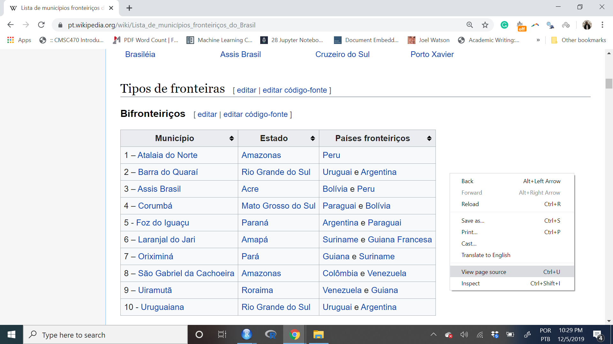
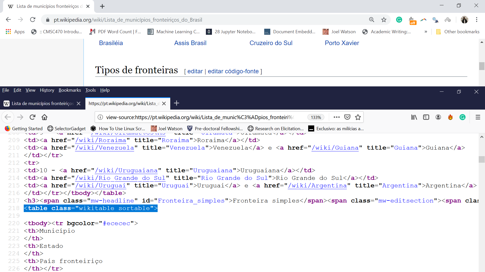

```{r setup, include=FALSE}
options(htmltools.dir.version = FALSE)
knitr::opts_chunk$set(message=FALSE, warning = FALSE, error = FALSE, cache = TRUE, 
                      out.width = "50%")

``` 


```{r knitr_init, echo=FALSE, cache=FALSE}

library(knitr)
library(rmdformats)

## Global options
opts_chunk$set(cache=TRUE,
               prompt=FALSE,
               comment=NA,
               message=FALSE,
               warning=FALSE)


```

# Plano de Hoje:

Vamos dar primeiros passos de como coletar dados na internet. 

- Nocões Teóricas de Raspagem de Dados


- Básico de html

- `rvest` para raspagem de sites. 

<br><br><br>

**Próxima Aula**: programação funcional e automatização de coleta de dados. 

---
## Introdução. 

Há duas formas principais de acessar dados na internet:

1. Raspar dados em websites

2. Acessar APIs (Interface de Programação de Aplicações). 


<br><br>

**Acessar dados via APIs é mais seguro, prático, e rápido. Raspar dados é mais difícil, e mais desafiador. Por isso, sempre opte pela segunda.** 

---
## O que é raspagem de dados ? 

Raspagem de dados consiste em coletar automaticamente dados disponíveis em sites da internet. 

Você pode fazer isto na mão. Porém, nosso esforço permanente aqui neste curso, é aprender a botar nosso computador para trabalhar. 

Exemplos de sites que eu coletei dados: 

- Dados eleitorais no congresso.

- Composição de elites ao redor do mundo. 

- Informação de municípios disponíveis no wikipedia, 

- Programas de governo dos candidatos a prefeito no site do TSE. 

- Preço de imóveis no site do Zap Móveis. 


---
## Rotina Básica.

--
.pull-left[

### Teórica

- Encontre o nome das páginas da internet

- Fazer o download dos sites em formato HTML ou XML

- Encontrar as partes do site que são do seu interesse (aqui dá bastante trabalho)

- Limpar e processar os dados
]

--

.pull-right[

### Em R.

- Tentar com apenas um site todos os passos acima

- Escrever um funçao em R para você repetir de forma automática a operação

- Aplicar a função a sua lista de sites. 

]

--

---

## Ética em Raspagem de Dados

- Respeite o robots.txt

- Não atinja servidores com muita frequência

- Retarde  seu código para a velocidade que humanos fariam manualmente

- Encontre sites de origem confiáveis

- Não raspe durante o horário de pico

- Melhore a velocidade do seu código

- Use dados com responsabilidade (Como acadêmicos geralmente fazem) 

---
class: center, middle inverse

# Raspando Sites Estáticos

---

## Rotinas

- Encontre o site

- Pratique com um caso

- Torne-se o mestre nesse caso

- Escreva uma funçao para expandir a coleta

- Salve. 

---

## Encontre um site: Mas o que é um site?

HTML + Javascript. 


```{r, eval=FALSE}

<html>
<head>
  <title> Michael Cohen's Email </title>
  <script>
    var foot = bar;
  <script>
</head>
<body>
  <div id="payments">
  <h2>Second heading</h2>
  <p class='slick'>information about <br/><i>payments</i></p>
  <p>Just <a href="http://www.google.com">google it!</a></p>
  <table>

```

---

--

class:middle

####  As tags de html são os elementos que precisamos acessar para fazer a raspagem

--
```{r, eval=FALSE}

<html>
<head>
  <title> Michael Cohen's Email </title>
  <script>
    var foot = bar;
  <script>
</head>
<body>
  <div id="payments">  #<<
  <h2>Second heading</h2>
  <p class='slick'>information about <br/><i>payments</i></p>
  <p>Just <a href="http://www.google.com">google it!</a></p>
  <table>

```
--

---
## Eu preciso aprender HTML?

--
.pull-left[
```{r out.width="80%", echo=FALSE}
knitr::include_graphics("https://media.giphy.com/media/cCbf4ryl0UQWBwOLiQ/giphy.gif")
```
]

--

.pull-rigt[

<br>

#### Caminhos para raspagem:

- Inspecionar os sites e aprender html. 

- Usar o [Selector Gadget]("https://selectorgadget.com/")
]

---

## Exemplo 1: Municípios de Fronteira no Brasil. 


---
## Caminho 1: Pegar o Marcador Manualmente.



---
<br>



---

### Vamos começar nosso percurso no R

```{r, eval=FALSE}

# Pacotes
install.packages("tidyverse")
install.packages("purrr")
install.packages("rvest")
install.packages("stringr")
install.packages("kableExtra")
install.packages("Rcurl")
library("tidyverse")
library("purrr")
library("rvest")
library("stringr")
library("kableExtra")


```

---

#### Crie um objeto com o nome da sua url
```{r}
minha_url <- "https://pt.wikipedia.org/wiki/Lista_de_munic%C3%ADpios_fronteiri%C3%A7os_do_Brasil"
```

#### Raspe os dados. Extrair o html a partir do site. 

```{r}
source <- read_html(minha_url)
```

#### O que é esse objeto?
```{r}
class(source) # XML=HTML
```

---

## html_table(): extraindo Tabelas

```{r}
tabelas <- source %>% 
            rvest::html_table() 
```

#### O que eu tenho aqui?

```{r}
tabelas[[3]]
```

---

### Limpar e Salvar nossos primeiros dados

```{r}
tabela_limpa <- tabelas[[3]] %>% 
            
            # Converte para um banco de dados mais bonito
            as.tibble() %>% 
  
            # Cria Duas novas Colunas
            mutate(city = Município, 
                   uf_name = Estado) %>%
            select(city, uf_name) %>%
            
            # consertar o enconding
            mutate(city = str_sub(city,5),
                   city = str_replace(city, pattern="- ", ""), 
                   city =  str_trim(city),
                   city_key = stringi::stri_trans_general(city, "Latin-ASCII"), 
                   city_key= str_replace_all(city_key, " ", ""), 
                   city_key=str_to_lower(city_key)) 

tabela_limpa

```

---

# Raspagem de dados usando CSS Selector

Raspar dados de tabelas é tarefa fácil. 

Tudo fica mais complicado quando os sites possuem estruturas mais complexas, e precisamos usar os marcadores de HTML (chamados de CSS). Para isto, usaremos o CSS Selector Gadget. 

Neste exemplo, vou acessar a pagina privada de cada um dos 71 deputados da Assembléia Legislativa do Estado do Rio de Janeiro. Vamos coletar: 

- Nome
- Email
- Biografia
- Partido

---

### Exemplo do CSS Selector


---

### Passos do CSS Selector. 


- Ative o CSS no seu borwser,

- Dê um clique na informação que você quer extrair -> Amarelo. 

- Um segundo clique caso você esteja capturando mais do que precisa. 

- Repita isso até isolar o seu alvo de interesse. 

- Copie e cole o resultado dentro da função `html_nodes()`

---

### Processando os nomes (`html_text`)

```{r}
# Coleta de todos os nomes

minha_url <- "http://www.alerj.rj.gov.br/Deputados/QuemSao"

nomes <- read_html(minha_url) %>%
          html_nodes(css=".nome a") %>%
          html_text() #<<

# Limpa os nomes

nomes_limpos <- nomes %>% 
                  str_to_title()

nomes_limpos

```

---

### Acessando os links. (`html_attr`)


```{r}

links <- read_html(minha_url) %>%
          html_nodes(css=".nome a") %>%
          html_attr("href") #<<

# Combina os links com a estrutura básica da página da UERJ. 

links <- paste0("http://www.alerj.rj.gov.br/", links)

# Criar um banco de dados. 

dados <- tibble(nomes=nomes, 
                links=links)


```

---

### Raspando um caso


```{r}

# url
link <- dados$links[[1]]

#source
source <- link %>% read_html()

# informacao

nome <- source %>%
            html_nodes(css=".paginacao_deputados .titulo") %>%
            html_text() %>%
              str_remove_all(., "\\r|\\n") %>%
              str_trim() %>%
              str_squish()


partido <-  source %>% 
              html_nodes(css=".partido") %>%
              html_text() 

biografia <- source %>% 
            html_nodes(css=".margintop11") %>%
            html_text() %>% 
            paste0(., collapse = " ")


telefone <- source %>% 
    html_nodes(css=".margin_bottom_5+ p") %>%
    html_text()

email <- source %>% 
    html_nodes(css="#formVisualizarPerfilDeputado p+ p") %>%
    html_text()

# Combina tudo como um banco de dados

deputados <- tibble(nome, link, partido, biografia, telefone, email)
```

---
```{r}
deputados
```

--
<br>
.alert[
<h2> E agora? </h2>]

--

Finalizamos agora nossa primeira etapa. Precisamos expandir isso para todos os deputados. 


 - Converter nossa código para uma função. 
 
 - Aplicar a função a uma lista de links(Programação funcional)
 
 - Próxima Aula. 

--

---

## Desafio de Hoje

O exercício de hoje vai ser o seguinte. Quero que vocês repitam o exercício acima, porém, para outro o site da assembleia legislativa do Estado de São Paulo

1. Colete o nome de todos os deputados-as.

2. Colete o link das páginas pessoais de todos os deputados-as.

3. Para um caso, extraia da da página pessoal todas as informações disponíveis sobre esse deputado-a. 

---
class: center, middle, inverse

## Aula II: Raspagem e Programação Funcional. 

