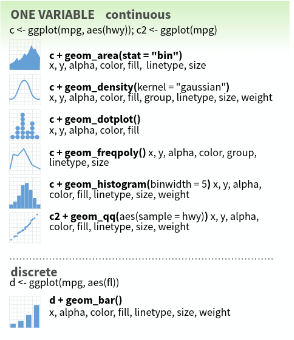
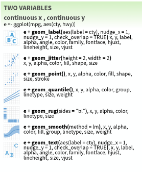
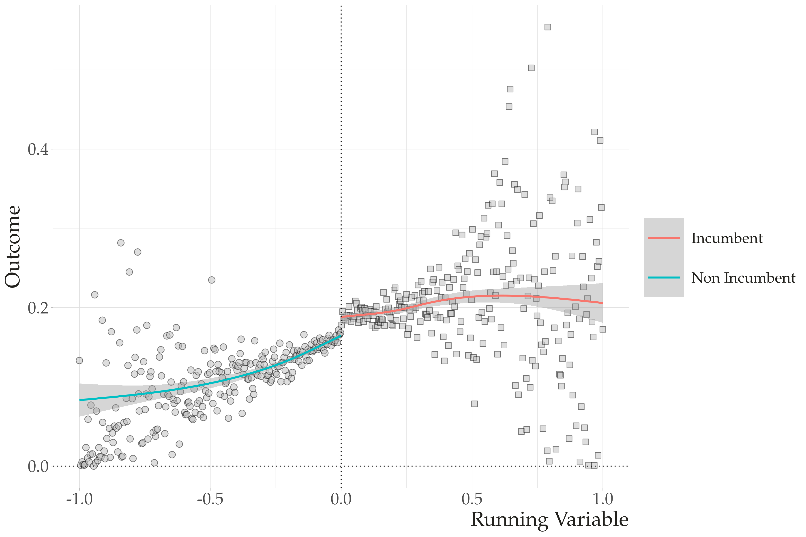

```{r setup, include=FALSE}
options(htmltools.dir.version = FALSE)
knitr::opts_chunk$set(message=FALSE, warning = FALSE, error = FALSE, cache = TRUE, 
                      out.width = "50%")

``` 

class: middle, center, inverse

# Survey
---
class: middle, center

## Nestas primeiras semanas, o que você mais gostou do curso?


<br><br>

*A dinâmica da aula.*

*sair do R base e começar tidyverse :)*

*De ter exercícios toda semana. Está ajudando bastante a praticar e entender melhor o que aprendemos durante as aulas.*

*Tudo! As aulas são muito didáticas e os exercícios são mais puxados e ajudam a fixar o conteúdo e entender a útilidade prática dos recursos.*
---
class: middle, center

## Nestas primeiras semanas, o que você menos gostou da proposta de curso?


<br><br>


*O prazo do exercício ser sexta.*

*Nada*

*Os exercícios em grupo durantes a aula são legais, mas acaba sendo pouco tempo para debater e fazer as atividades. Mas de resto está tudo ótimo.*

*O horário do escritório virtual. Na maioria das vezes não consigo entrar porque tenho aula na hora e ainda não deu tempo de começar os exercícios.*

---
class: middle, center

## O que você acha que poderíamos mudar para nossas próximas semanas?

<br><br>

*Acho que o prazo do exercício podia ser sábado.*

*Poderíamos ver a aplicação do R em alguma pesquisa.*

*Se possível, o horário do escritório virtual (se for melhor para a maioria). Mas se não tiver como, se problemas!*

---
class: middle, center, inverse

# Visualização de Dados. 

---

--

# Ciência de Dados em R.


```{r out.width="50%", echo=FALSE}
knitr::include_graphics("figs/data-science.png")
```

--

# Onde Estamos

```{r out.width="50%", echo=FALSE}

```

--

---

# Introdução: Visualização de Dados com ggplot.


Para aprendar sobre visualização de dados, vamos percorrer os seguintes passos. 


1. Preparaçao de Dados: Porquê preciso dos meus dados Tidy?

2. Introdução ao ggplot: Geoms and Aesthetics

3. Acessários dos gráficos: labels, escalas, títulos, e outros. 

4. Casos Aplicados: reproduzindo gráficos de artigos acadêmicos. 


---

## Preparação dos Dados: Porquê preciso dos meus dados Tidy?

80% do trabalho de visualização de dados está em preparar seus dados. 

```{r out.width="50%", echo=FALSE}
knitr::include_graphics("figs/tidy-1.png")
```


O `ggplot` funciona conectando colunas com visuais. 

E para fazer isto, precisamos de que cada coluna seja uma variável -- exatamente como dados tidy são organizados. 

---

### Grammar of Graphics.


.pull-left[

```{r out.width="50%", echo=FALSE}
knitr::include_graphics("figs/grammar_graphics.png")
```

]

.pull-right[
O ggplot é baseado na [Grammar of Graphics](https://www.springer.com/gp/book/9780387245447).

A grammar of graphics é uma linguagem desenvolvida para criar e descrever de forma unificada visualizações gráficas. Esta linaguem funciona com duas regras fundamentais:

- Os gráficos são construídos em camadas. 

- Cada variável precisa ser mapeada a uma representação gráfica. 
]
---

## ggplot: intuição.

O `ggplot` implementa o framework do **Grammar of Graphics** em R. Como esperado,  Cada gráfico é construído camada por camada: 

- Começando com seus dados, 
- Mapeamento Dados -> Visuais (aes), 
- Decisões geométricas (geoms) e,
- Embelezamento do gráfico (scale, theme e labels). 

E sua lógica fundamental funciona conectando **variáveis** a  **representações gráficas** por meio de uma função chamada __aesthethics mapping__ (aes). 

---

## ggplot: na prática.

Quatro "grande" etapas definem nosso trabalho de visualização:

1. **Etapa dos Dados**: Define qual banco de dados você pretende visualizar

2. **Etapa de Mapear**: Define quais **variáveis -> representações gráficas** você pretende visualizar. 

3. **Etapa de Geom**: Define como você pretende visualizar. 

4. **Etapa de Embelezamento**: Labels, escalas, coordenados, temas....

---

## Funções do ggplot: em abstrato


---

## Funções do ggplot: em abstrato II


.pull-left[
```{r  echo=FALSE, out.width = "70%"}
knitr::include_graphics("figs/ggplot_flow1.png") 
```
]

.pull-right[
```{r  echo=FALSE, out.width = "62%"}
knitr::include_graphics("figs/ggplot_flow2.png") 
```
]

---


## Funções do ggplot: Com Dados.


```{r out.width="40%"}
library(tidyverse)
library(gapminder)

ggplot(data=gapminder, ## Etapa dos Dados
       aes(y=lifeExp, x=gdpPercap)) + # Etapa de Mapear
      geom_point() # Etapa do Geom

```

---
class: center, middle, inverse


# Geoms:

## Como queremos visualizar nossos dados? 

## Pontos? Linhas? Densidade? Barras?

---

## Tipos de Gráfico: Uma variável. 

.pull-left[

]

- Somente uma variável como input (no eixo x). 

- Os valores do eixo y são calculados diretamente pelo `ggplot`, de acordo com o gráfico do seu interesse. 

---

### geom_density

--
.pull-left[
```{r out.width="80%"}
ggplot(data=gapminder,  # dados
        mapping=aes(x=lifeExp)) + # mapear
      geom_density() # forma geométrica
```
]

--

.pull-right[
```{r out.width="80%"}
ggplot(data=gapminder,  # dados
        mapping=aes(x=lifeExp)) + # mapear
      geom_density(alpha=.5, 
                   fill="tomato2") 

```
]

--

---

### geom_histogram

--
.pull-left[
```{r out.width="80%"}
ggplot(data=gapminder,  # dados
        mapping=aes(x=lifeExp)) + # mapear
      geom_histogram() # forma geométrica
```
]

--

.pull-right[
```{r out.width="80%"}
# Adiciona Color e Fill
ggplot(data=gapminder,  # dados
        mapping=aes(x=lifeExp)) + # mapear
      geom_histogram(bins=50, 
                     color="black", 
                     fill="lightgreen") # forma geométrica

```
]

--

---

## geom_bar (variável discreta)

`geom_bar` funciona da mesma forma que `geom_hist`, porém a variável `x` é categórica (discreta).  O `y` será a soma de observações em cada grupo presente em x. 


```{r}
ggplot(data=gapminder,  # dados
        mapping=aes(x=continent)) + # mapear
      geom_bar() 
```

---

## Tipos de Gráfico: Contínua x Contínua.



---

### geom_point

--

.pull-left[
```{r out.width="80%"}
ggplot(data=gapminder, ## Etapa dos Dados
       aes(y=lifeExp, 
           x=gdpPercap)) + # Etapa de Mapear
      geom_point() # Etapa do Geom

```
]

--

.pull-right[
```{r out.width="80%"}
# Adiciona Shape e alpha.

ggplot(data=gapminder, ## Etapa dos Dados
       aes(y=lifeExp,
           x=gdpPercap)) + # Etapa de Mapear
      geom_point(shape=22, alpha=.5, 
                 fill="tomato2", 
                 color="black", 
                 size=2) # Etapa do Geom

```
]
--

---

### geom_smooth


```{r}

ggplot(data=gapminder, ## Etapa dos Dados
       aes(y=lifeExp, x=gdpPercap)) + # Etapa de Mapear
      geom_smooth(fill="steelblue", 
                 color="black", 
                 size=1, alpha=.3) # Etapa do Geom

```

---

## Múltiplos geoms. 

.pull-left[
```{r eval=FALSE}
ggplot(data=gapminder,
       aes(y=lifeExp,
           x=gdpPercap)) + 
      
      # Pontos
      
    geom_point(shape=22, alpha=.2, #<<
                 fill="tomato2", 
                 color="black", 
                 size=2) + 

  
      # Tendência
    
      geom_smooth(fill="tomato2", #<<
                 color="black", 
                 size=1, alpha=.6)

```
]


.pull-right[
```{r echo=FALSE, out.width="80%"}
ggplot(data=gapminder, ## Etapa dos Dados
       aes(y=lifeExp, x=gdpPercap)) + # Etapa de Mapear
      
      # Pontos
      
    geom_point(shape=22, alpha=.2, #<<
                 fill="tomato2", 
                 color="black", 
                 size=2) + 

  
      # Tendência
    
      geom_smooth(fill="tomato2", #<<
                 color="black", 
                 size=1, alpha=.6)

```
]
---

## Tipos de Gráfico: Discreta x Contínua.


---

### geom_boxplot

```{r}
ggplot(data=gapminder, ## Etapa dos Dados
       aes(y=lifeExp, x=continent)) + # Etapa de Mapear
      
      # Pontos
      
    geom_boxplot(fill="tomato2", #<<
                 color="black", 
                 size=1.5, 
                 alpha=.5)  # Etapa do Geom

```

---

# Representações Gráficas (aes)

Até aqui, usamos basicamente duas representações gráficas dentro das nossa função de mapear (aes): os eixos `x` e `y`. 

Intuitivamente, costumamos pensar nos eixos x e y como as únicas variáveis no banco de dados e consideramos outros elementos dos gráficos -- cores, transparência, formato -- como acessórios. 

Esta **não** é a forma como o `ggplot` funciona.

Todas as representações gráficas -- `color, fill, shape, alpha, linetype`, etc... -- podem ser mapeadas a variáveis do seu banco de dados. Este processo funciona adicionando mais elementos dentro da nossa função de mapear (`aes`). 


---

## Quais Representações gráficas (aes) estão disponíveis?


---

## Color: Para Colorir Dados Agrupados. 

```{r}

ggplot(data=gapminder, ## Etapa dos Dados
       aes(y=lifeExp, x=gdpPercap, # Etapa de Mapear
           color=continent)) + # Com fill #<<
      geom_point() # Etapa do Geom

```

---

## Fill: Para Preencher Dados Agrupados.

```{r}
ggplot(data=gapminder,  # dados
        mapping=aes(x=lifeExp, fill=continent)) + #<<
      geom_density(alpha=.5) # forma geométrica

```

---

```{r}
gap_grouped <- gapminder %>%
                group_by(year, continent) %>%
                summarise(m=mean(lifeExp, na.rm = TRUE))

ggplot(data=gap_grouped,  # dados
        mapping=aes(x=year, y=m, 
                    fill=continent)) + #<<
      geom_bar(stat="identity", position="dodge")  #<<

```

---

## Alpha e size: Para mostrar variação em valores. 

```{r}
ggplot(data=gapminder, ## Etapa dos Dados
       aes(y=lifeExp, x=gdpPercap)) + # Etapa mapear 
      geom_point(aes(alpha=pop, #<<
           size=log(pop))) + #<<
      geom_smooth(color="red") + # Etapa do Geom
      scale_x_log10()

```

---

## Shape

```{r}
gap_grouped <- gapminder %>%
                group_by(year, continent) %>%
                summarise(m=mean(lifeExp, na.rm = TRUE))

ggplot(data=gap_grouped, ## Etapa dos Dados
       aes(y=m, x=year, 
           shape=continent)) + #<<
      geom_point(size=3) +
      geom_line()
```


---

### Desafio:

Descreva o gráfico abaixo usando o que aprendemos do ggplot e grammar of graphics. 

- Quantas Variáveis? Quantas Representações Gráficas?

- Quais Geoms? Quais Representações Gráficas?

```{r echo=FALSE, out.width="80%"}

```


