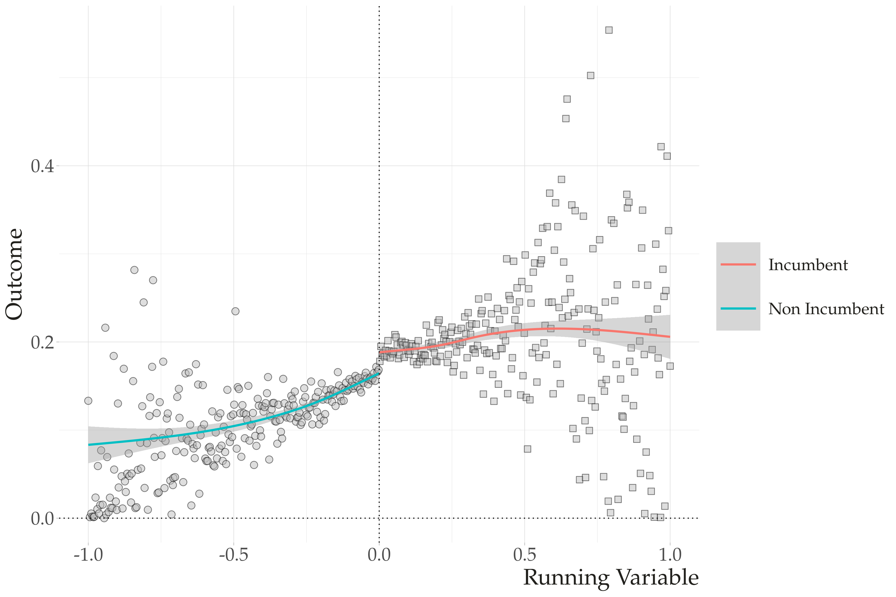

```{r setup, include=FALSE}
options(htmltools.dir.version = FALSE)
knitr::opts_chunk$set(message=FALSE, warning = FALSE, error = FALSE, cache = TRUE, 
                      out.width = "50%")

``` 

# Revisão sobre ggplot2


.pull-left[


]

.pull-right[

Quatro "grande" etapas definem nosso trabalho de visualização:

1. **Etapa dos Dados**: Define qual banco de dados você pretende visualizar

2. **Etapa de Mapear**: Define quais **variáveis -> representações gráficas** você pretende visualizar. 

3. **Etapa de Geom**: Define como você pretende visualizar. 

4. **Etapa de Embelezamento**: Labels, escalas, coordenados, temas....


]

---

## Múltiplos Geoms

.pull-left[

```{r eval=FALSE, out.width="80%"}
ggplot(data=gapminder, 
       aes(y=lifeExp, x=gdpPercap)) + 
      
      # Pontos
      
    geom_point(shape=22, alpha=.2, #<<
                 fill="tomato2", 
                 color="black", 
                 size=2) + 

  
      # Tendência
    
      geom_smooth(fill="tomato2", #<<
                 color="black", 
                 size=1, alpha=.6)

```
]

.pull-right[
```{r echo=FALSE, out.width="80%"}
ggplot(data=gapminder,
       aes(y=lifeExp, x=gdpPercap)) + 
      
      # Pontos
      
    geom_point(shape=22, alpha=.2, #<<
                 fill="tomato2", 
                 color="black", 
                 size=2) + 

  
      # Tendência
    
      geom_smooth(fill="tomato2", #<<
                 color="black", 
                 size=1, alpha=.6)

```
]

---

## Representações Gráficas como Variáveis.

.pull-left[

```{r eval=FALSE}
ggplot(data=gapminder, 
       aes(y=lifeExp, x=gdpPercap)) + 
  
  geom_point(aes(alpha=pop, #<<
           size=log(pop))) + #<<
  
  geom_smooth(color="red") +
  
  scale_x_log10()

```

]


.pull-right[

```{r echo=FALSE, out.width="80%"}
ggplot(data=gapminder, 
       aes(y=lifeExp, x=gdpPercap)) + 
  
  geom_point(aes(alpha=pop, #<<
           size=log(pop))) + #<<
  
  geom_smooth(color="red") +
  
  scale_x_log10()

```

]


---
### Desafio:

Descreva o gráfico abaixo usando o que aprendemos do ggplot e grammar of graphics. 

- Quantas Variáveis? Quantas Representações Gráficas?

- Quais Geoms? Quais Representações Gráficas?

```{r echo=FALSE, out.width="80%"}

```

---

class: middle, center, inverse

# Visualização de Dados II. 

---
# Customização: Escalas + Labels + Temas.

A idéia de customização consiste em ajustar seu gráfico para apresentá-lo da forma mais efetiva possível. 

Este processo vai desde definir quais cores utilizar, nomes dos eixos, background dos gráficos, posição de legendas, entre outros. 

Começaremos com os ajustes de escalas.


---

## Scales

As funções do tipo `scale_function` controlam como você apresenta cada representação gráfica (aes) do seu gráfico.  

Por exemplo, estas funções permitem alterações nos eixos `x` e `y`, e nas outras representações como `color`, `fill`, `shape`, entre outros. 

Os exemplos mais básicos das funções `scale_` se referem aos eixos `x` e `y`. Alguns exemplos:

- `scale_x_log10` e `scale_y_log10` : converte um eixo númerico para escala de log. 
- `scale_y_reverse` e `scale_x_reverse` : inverte os valores de x e y. 
- `scale_x_continuous` e `scale_y_continous`: formata x e y quando são variáveis continuas. 
- `scale_x_discrete` e `scale_y_discrete`: formata x e y quando são variáveis discretas. 
- `scale_x_date` e `scale_y_date`: formata x e y quando são variáveis discretas. 

---

### Exemplos

Convertando o eixo x para log10 e alterando o nome. 

```{r}
library(gapminder)
library(tidyverse)

# Convertendo scale x para log. 
ggplot(data=gapminder, 
       aes(y=lifeExp, x=gdpPercap)) + 
      geom_point()  +
      scale_x_log10(name="Log gdp") 

```

---
## Limites e Separação

```{r}

gap_grouped <- gapminder %>%
                group_by(year, continent) %>%
                summarise(m=mean(lifeExp, na.rm = TRUE))

ggplot(data=gap_grouped, 
       aes(y=m, x=year, 
           color=continent)) + 
      geom_point(size=3) +
      geom_line() +
      scale_x_continuous(breaks = unique(gap_grouped$year)) +
      scale_y_continuous(limits = c(25,100))

```

---

## Ajustando Outras Representações. 

As funções `scale` são também muito úteis para ajustar outras representações gráficas, como fill, color, shape, size, entre outras. Alguns exemplos destas funções:

- `scale_aes_manual`: altera cores, shapes, fill para cada grupo de sua variável. 
- `scale_aes_gradient`: altera escalas de cores de forma continua. 
- `scale_aes_brewer`: altera palleta de cores para representação gráfica. 

---

### scale_aes_manual

```{r}

ggplot(data=gap_grouped, 
       aes(y=m, x=year, 
           color=continent)) + 
      geom_point(size=3) +
      geom_line() +
      scale_x_continuous(breaks = unique(gap_grouped$year)) +
      scale_y_continuous(limits = c(25,100)) +
      scale_color_manual(name="Continent", 
                         values = c("white", "blue", "red", "yellow", "green"))
```


---

## Usando Paletas

Usualmente, não adicionamos as cores de forma manual. O R possui paletas de cores pensadas de forma cuidadosa para representar seus gráficas. Dentre elas, minha favorita é do pacote `wesanderson`. 

```{r}
#devtools::install_github("karthik/wesanderson")
library(wesanderson)
pal <- wes_palette("Royal2")
pal
```

---
```{r}
# Novo gráfico
ggplot(data=gap_grouped, 
       aes(y=m, x=year, 
           color=continent)) + 
      geom_point(size=3) +
      geom_line() +
      scale_x_continuous(breaks = unique(gap_grouped$year)) +
      scale_y_continuous(limits = c(25,100)) +
      scale_color_manual(name="Continent", 
                         values = pal)

```

---

### scale_aes_gradient

```{r}
ggplot(data=gapminder, 
       aes(y=lifeExp, x=gdpPercap, 
           fill=lifeExp)) + 
      geom_point(shape=21, size=2) +
  scale_x_log10() +
  scale_fill_gradient(low="yellow", high="red", 
                      name="Life Expectancy")
```

---

### scale_aes_brewer

.pull-left[
```{r out.width="100%"}

# Exemplo 1
ggplot(data=gapminder,
       aes(y=lifeExp, x=continent, 
           fill=continent)) +
      
      # Pontos
      
    geom_boxplot(size=1.5, 
                 alpha=.5)  

```
]

.pull-rigth[
```{r}

# Exemplo 2
ggplot(data=gapminder,
       aes(y=lifeExp, x=continent, 
           fill=continent)) + 
      
      # Pontos
      
    geom_boxplot(size=1.5, 
                 alpha=.5) +  

    scale_fill_brewer(palette = "Set1") #<<

```
]

---

Para ver algumas paletas disponíveis:

```{r}
#install.packages("RColorBrewer")
library(RColorBrewer)
RColorBrewer::display.brewer.all()
```

---

## Labels e Títulos

.pull-left[
```{r eval=FALSE}
ggplot(data=gapminder, 
       aes(y=lifeExp, x=continent, 
          fill=continent)) + 
    geom_boxplot(size=1.5, alpha=.5) +  
    scale_fill_brewer(palette = "Set1") +
  
    # Nova camada
  
  labs(
    x = "Continentes", 
    y = "Expectativa de Vida", 
    fill = "Continente",
    title = "Expectativa de Vida Por Continente",
    subtitle = "Fonte: gapminder", 
    caption = " Author: Tiago Ventura"
  )


```
]

.pull-right[
```{r echo=FALSE, out.width="80%"}
ggplot(data=gapminder,  aes(y=lifeExp, x=continent, 
           fill=continent)) + # Etapa de Mapear
    geom_boxplot(size=1.5, alpha=.5) +  # Etapa do Geom
    scale_fill_brewer(palette = "Set1") +
  
    # Nova camada
  
  labs(
    x = "Continentes", 
    y = "Expectativa de Vida", 
    fill = "Continente",
    title = "Expectativa de Vida Por Continente",
    subtitle = "Fonte: gapminder", 
    caption = " Author: Tiago Ventura"
  )


```
]

---

## Removendo Legendas
.pull-left[
```{r}
ggplot(data=gapminder,
       aes(y=lifeExp, x=continent, 
           fill=continent)) + 
      
      # Pontos
      
    geom_boxplot(size=1.5, 
                 alpha=.5) +  

    scale_fill_brewer(palette = "Set1") +
  
    guides(fill="none")

```
]

.pull-right[
```{r}
ggplot(data=gapminder,
       aes(y=lifeExp, x=continent, 
           fill=continent, 
           color=continent)) + 
      
      # Pontos
      
    geom_boxplot(size=1.5, 
                 alpha=.5) +  

    scale_fill_brewer(palette = "Set1") +
  
    guides(color="none")

```
]

---

## Alterando Posições da Legenda

```{r}

ggplot(data=gapminder,
       aes(y=lifeExp, x=continent, 
           fill=continent)) + 
      
      # Pontos
      
    geom_boxplot(size=1.5, 
                 alpha=.5) +  

    scale_fill_brewer(palette = "Set1") +
  
    theme(legend.position="bottom")

```


---

## Facetting. 

O último truque do ggplot que é muito útil quando trabalhamos com dados agrupados são as funções `facet_`.  

Estas funções nos permitem dividir os gráficos em pequenas partes (sub-gráficos) a partir de determinados grupos. 

---

```{r}

# Colunas
ggplot(data = gapminder, mapping = aes(x = year, y = gdpPercap)) +
  geom_line(color="gray70", aes(group = country)) +
  geom_smooth(size = 1.1, method = "loess", se = FALSE) +
  scale_y_log10() +
  labs(x = "Year",
         y = "GDP per capita",
         title = "GDP per capita on Five Continents") +
  # facet
  facet_wrap(~ continent) 
  
```

---

## Customização de forma consistente: usando theme. 

```{r}
# Set up my theme  ------------------------------------------------------------
my_font <- "Palatino Linotype"
my_bkgd <- "#f5f5f2"
pal <- RColorBrewer::brewer.pal(9, "Spectral")
my_theme <- theme(text = element_text(family = my_font, color = "#22211d"),
                  rect = element_rect(fill = my_bkgd),
                  plot.background = element_rect(fill = my_bkgd, color = NA),
                  panel.background = element_rect(fill = my_bkgd, color = NA),
                  panel.border = element_rect(color="black"), 
                  strip.background = element_rect(color="black", fill="gray85"), 
                  legend.background = element_rect(fill = my_bkgd, color = NA),
                  legend.key = element_rect(size = 6, fill = "white", colour = NA), 
                  legend.key.size = unit(1, "cm"),
                  legend.text = element_text(size = 14, family = my_font),
                  legend.title = element_text(size=14),
                  plot.title = element_text(size = 22, face = "bold", family=my_font),
                  plot.subtitle = element_text(size=16, family=my_font),
                  axis.title= element_text(size=10),
                  
                  axis.text = element_text(size=10, family=my_font),
                  axis.title.x = element_text(hjust=1),
                  strip.text = element_text(family = my_font, color = "#22211d",
                                            size = 10, face="italic"))

my_theme  <- theme_bw() + my_theme
```

---
### Salva como Template no seu R

```{r eval=FALSE}
# This sets up for all your plots
theme_set(theme_bw() + my_theme)

```


### Ou Adiciona Manualmente. 

.pull-left[
```{r eval=FALSE}
graph <- ggplot(data=gapminder, 
                
            aes(y=lifeExp, x=continent, 
           fill=continent)) + 
  
  geom_boxplot(size=1.5, alpha=.5) +  
  
  scale_fill_brewer(palette = "Set1") #<<

graph + 
  my_theme

```
]

.pull-right[
```{r echo=FALSE, out.width="80%"}
graph <- ggplot(data=gapminder, 
                aes(y=lifeExp, x=continent, 
           fill=continent)) + # Etapa de Mapear
    geom_boxplot(size=1.5, alpha=.5) +  # Etapa do Geom
    scale_fill_brewer(palette = "Set1") 

graph +  my_theme

```
]

---

## Temas Pré-Construídos.

```{r}
#install.packages(c("ggthemes", "hbrthemes"))
library(ggthemes)
library(hrbrthemes)
 
graph + 
  theme_minimal()
```

---

```{r}

graph + 
  theme_economist()

```

---

```{r}

graph + 
  theme_fivethirtyeight()

```

---

```{r}

graph + 
  theme_ipsum()

```

---


## Exercício da Semana (Valendo Ponto Extra). 

Esta semana vocês **não farão exercício de programação**.

Porém terão uma tarefa simples.  Dentre os quatro artigos abaixo:

[Will I Get Covid?](http://tiagoventura.rbind.io/publication/will_i_get_covid/Calvo_Ventura_Covid_Social_Media.pdf)

[Connective Effervescence and Streaming Chat During Political Debates](http://tiagoventura.rbind.io/files/CCMV_Bringing_Audience.pdf)

[Trustful Voters, Trustworthy Politicians: A Survey Experiment on the Influence of Social Mediain Politics](http://tiagoventura.rbind.io/publication_wp/trust/trust.pdf)

[The Effect of Streaming Chat on Perceptions of Debates](http://tiagoventura.rbind.io/files/ACMMV_the_effect_of_streaming_chat_on_perceptions_of_debates.pdf)

Você deve: 

- Selecionar **um gráfico** entre os cinco artigos para reproduzirmos na segunda.

- Envie via slack, até sexta-feira, meia noite. 

- Vamos reproduzir os gráficos na próxima segunda. 


