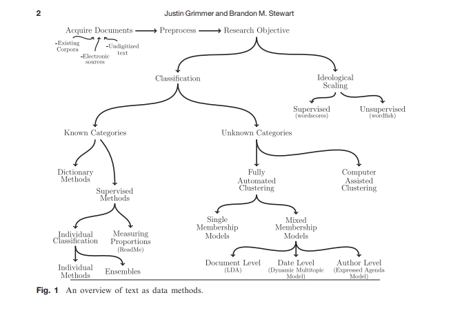
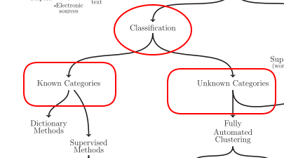
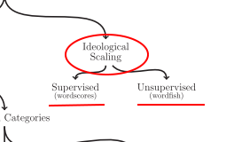

```{r setup, include=FALSE}
options(htmltools.dir.version = FALSE)
knitr::opts_chunk$set(message=FALSE, warning = FALSE, error = FALSE, cache = TRUE, 
                      out.width = "50%")

``` 


```{r knitr_init, echo=FALSE, cache=FALSE}

library(knitr)
library(rmdformats)

## Global options
opts_chunk$set(cache=TRUE,
               prompt=FALSE,
               comment=NA,
               message=FALSE,
               warning=FALSE)


```

## Grimmer and Stewart: Text as Data.

Política e conflitos políticos usualmente ocorrem a partir de textos:

- Leis, discursos e propostas legislativas. 

- Tratados internacionais. 

- Manifestos partidários

- Análise de média social. 

- Matérias de jornais...

**Imensidão de dados**

**Explosão de novos e mais eficientes métodos para análise destes dados de forma automatizada.**


---
class: center, middle
```{r out.width="100%", echo=TRUE}

```

---
## Classificação

<br>

.center[
```{r out.width="70%", echo=FALSE}

```
]


---
## Escalonamento

<br>
.center[
```{r out.width="70%", echo=FALSE}

```
]

---
##  Quatro Principios + Um do Tiago. 

1. Pense no seu objetivo e depois veja em qual caixa dos métodos você se encaixa. 

2.  All quantitative models of language are wrong—but some are useful.

3. Quantitative methods for text amplify resources and augment humans.

4. There is no globally best method for automated text analysis.

5. Validate, Validate, Validate.

---

class: center, middle, inverse

## Perguntas

---

## Exercício. 

Em grupos, vocês farão o seguinte exercício:

1. Pense em um banco de dados. 

2. Elabore uma pergunta para ser respondida com este banco de dados. 

3. Qual método acima você usaria para responder a esta pergunta?


