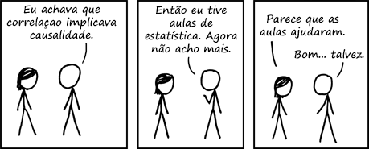

```{r setup, include=FALSE}
options(htmltools.dir.version = FALSE)
knitr::opts_chunk$set(message=FALSE, warning = FALSE, error = FALSE, cache = TRUE, 
                      out.width = "50%")

``` 


```{r knitr_init, echo=FALSE, cache=FALSE}

library(knitr)
library(rmdformats)

## Global options
opts_chunk$set(cache=TRUE,
               prompt=FALSE,
               comment=NA,
               message=FALSE,
               warning=FALSE)


```

# Plano de Hoje:

- Porque Fazemos Experimentos?

- Aleatorização.

- Tipos de Experimento.


---
## Porquê Experimentos?

**O que experimentos nos permitem fazer?**

- Encontrar relações causais.

- Controlar intervenções. 

- Precisar o tamanho dos efeitos. 


```{r echo=FALSE}

```

---

## Como Experimentos Funcionam? Aleatorização. 

.pull-left[
Imaginem esta relação causal abaixo:

- P = Pressão Social

- I = Interesse por política.

- V = Votar. 

Como isolar os efeitos de P em V?
]

```{r echo=FALSE}

library(tidyverse)
library(dagitty)
library(ggdag)
library(causaleffect)
library(igraph)
library(latex2exp)

```

.pull-right[
```{r, echo=FALSE, out.width="100%"}
vote_ca_dag <- dagify(v ~ i + p,
       p ~ i,
       labels = c("i" = "Interesse por \n Política" , 
                  "v" = "Comparecimento",
                  "p" = "Pressão \nSocial"))

ggdag(vote_ca_dag) +
  theme_minimal()

```
] 

---
# E se aleatorizarmos pressão social?

Aleatorização: Seleção randômica entre tratamento e controle. 


```{r, echo=FALSE, out.width="60%"}

coords <- data.frame(matrix(c("v",1,1,
                              "p",0,2,
                              "i",2,2, 
                              "a", 0, 3),
                              nrow=4, ncol=3, byrow=T))

colnames(coords) <- c("name","x","y")

# model
model7 <- dagify(v ~ p + i,
                 p~a,
                 labels = c("a"= "Aleatorização", 
                          "i" = "Interesse por \n Política" , 
                  "v" = "Comparecimento",
                  "p" = "Pressão \nSocial"),
                 coords=coords) 

ggdag(model7, text = FALSE, use_labels = "label")

```

---

## Tipos de Experimentos

- Experimentos de Survey (Hoje). 

- Experimentos de Campo (Quarta-Feira).

- Experimentos de Laboratório. 


---
class:center, inverse, middle

# Vamos a discussão dos textos. 

